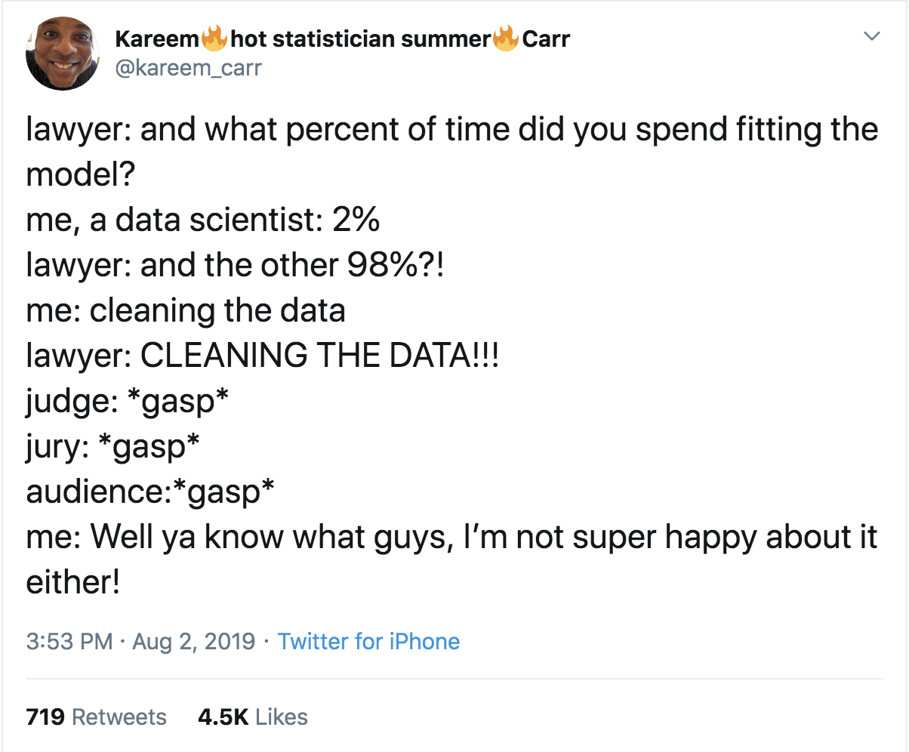
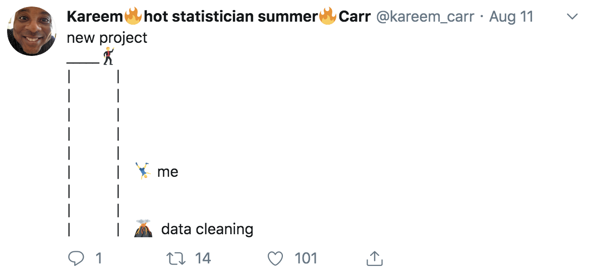

MSDS692 Data acquisition
=======

There are lots of exciting and interesting problems in data science, such as figuring out what the right question is, selecting features, training a model, and interpreting results. But all of that presupposes a tidy data set that is suitable for analysis or training models. Industry experts all agree that data collection and preparation is roughly 3/4 of any analysis effort. Or, as Kareem Carr puts it (I'm guessing he includes data acquisition and organization in the term "cleaning"):

<table border="0">
<tr valign="top" border="0">
<td border="0"></td><td border="0"></td>
</tr>
</table>

The title of this course is "Data Acquisition" but of course, once we get the data, we have to organize it into handy data structures and typically have to extract information from the raw data. For example, we might need to boil down a Twitter stream into a single positive or negative sentiment score for a given user.  This course teaches you how to collect, organize, coalesce, and extract information from multiple sources in preparation for your analysis work. Along the way, you'll learn about the commandline, git, networks, the internet protocols, and building your own web servers.

This course is part of the [MS in Data Science program at the University of San Francisco](https://www.usfca.edu/arts-sciences/graduate-programs/data-science).

# Course details

**INSTRUCTOR.** [Terence Parr](http://parrt.cs.usfca.edu). I’m a professor in the computer science and [data science program](https://www.usfca.edu/arts-sciences/graduate-programs/data-science) departments and was founding director of the MS in Analytics program at USF (which became the MS data science program).  Please call me Terence or Professor (not “Terry”).

**OFFICE HOURS**

Terence is generally available on slack or email on-demand.

**SPATIAL COORDINATES:** 

All classes are remote but live online, courtesy of COVID-19.

**TEMPORAL COORDINATES.** Tue Oct 13, 2020 - Thur Dec 1, 2020 (No lecture Dec 3)

There are lectures on Tuesday and Thursday each week from 10am - 12 noon California time. 

* Live lecture: Tue and Thur 10:00AM - 12Noon

Terence is generally available on-demand for help with exercises from the lecture or projects, even on weekends.

Exams:

* Exam 1: online, open-book and available for 24 hours
* Exam 2: online, open-book and available for 24 hours

**INSTRUCTION FORMAT**. Live class runs for 2 hours, 2 days/week. Instructor-student interaction during lecture is encouraged by speaking up in zoom. We'll often mix in mini-exercises / labs during class. All programming will be done in the Python 3 programming language, unless otherwise specified.

**PROFESSIONALISM**

The following items are even more important because all of us will be remote this Fall:
 
* Showing respect for your classmates and your professor
* Getting to class on time every time
* No cellphones, email, social media, slack, texting during the class
* Turn off all of your various notifications so you are not distracted
* Turn on your webcam on zoom

## Student evaluation

| Artifact | Grade Weight | Due date |
|--------|--------|--------|
|[Data pipeline](https://github.com/parrt/msds692/blob/master/hw/pipeline.md)| 5%| Thu, Oct 22 |
|[Search Engine Implementation](https://github.com/parrt/msds692/blob/master/hw/search.md)| 11% | Tue, Nov 3 |
|[TFIDF document summarization](https://github.com/parrt/msds692/blob/master/hw/tfidf.md)| 9%| Thu, Nov 12 |
|[Recommending Articles](https://github.com/parrt/msds692/blob/master/hw/recommender.md)| 7% | Thu, Nov 19 |
|[Tweet Sentiment Analysis](https://github.com/parrt/msds692/blob/master/hw/sentiment.md)| 9% | Thu, Dec 3 |
| [Code reviews](hw/code-review.ipynb) for 5 projects | 5% | Due 11:59PM on day associated project is due |
|Exam 1| 27%| 2-3:30PM Tue, Nov 10 and 12:01AM-1:31AM Nov 11 |
|Exam 2| 27%| 2-3:30PM Mon, Dec 7 and 12:01AM-1:31AM Dec 8|

<!--
| Artifact | Grade Weight | Due date |
|--------|--------|--------|
|[Data pipeline](https://github.com/parrt/msds692/blob/master/hw/pipeline.md)| 4%| Fri, Aug 30 11:59pm |
|[Search Engine Implementation](https://github.com/parrt/msds692/blob/master/hw/search.md)| 12% | Tue, Sep 10 |
|[TFIDF document summarization](https://github.com/parrt/msds692/blob/master/hw/tfidf.md)| 8%| Wed 11:59PM, Sep 18 |
|[Recommending Articles](https://github.com/parrt/msds692/blob/master/hw/recommender.md)| 8% | Tue, Sep 24 |
|[Tweet Sentiment Analysis](https://github.com/parrt/msds692/blob/master/hw/sentiment.md)| 8% | Tue, Oct 8 |
|Exam 1| 25%| Thu, Sep 12 |
|Exam 2| 35%| Thu, Oct 10 | must be dec 4 or 7-10
-->

All projects will be graded with the specific input or tests given in the project description, so you understand precisely what is expected of your program. Consequently, projects will be graded in binary fashion: They either work or they do not. The only exception is when your program does not run on the grader's or my machine because of some cross-platform issue. This is typically because a student has hardcoded some file name or directory into their program. In that case, we will take off *a minimum* of 10% instead of giving you a 0, depending on the severity of the mistake.  Some projects will be tested with some hidden unit tests; e.g., see the [evaluation section](https://github.com/parrt/msds692/blob/master/hw/search.md) of the search project.

Please go to github and verify that the website has the proper files for your solution. That is what I will download for testing.

Each project has a hard deadline and only those projects working correctly before the deadline get credit.  My grading script pulls from github at the deadline.  *All projects are due at the start of class on the day indicated, unless otherwise specified.*

**Groups**. All projects are **individual** projects not group efforts! You will be assigned to a two or three person group for each project in order to encourage you to meet your fellow students and discuss the design of each project. You're not allowed to share code at any time before the project due date and time. After all projects are submitted to github, you will share zips of your code with your partner or partners. Then, you will provide a quick (less than 30 minute) code review for your partner using a [code review template](https://github.com/parrt/msds692/blob/master/hw/code-review.ipynb).  There is an assignment on canvas where you can submit a PDF of the notebook. If there are 3 people in your group, you can pick which person's work to review.  **These code reviews do not affect the reviewed persons' grades**; they are meant to help you and your partner become better programmers. Since students don't do anything unless you give them points, each review gives you 1% of your grade. You just have to make a decent effort to get credit, otherwise you lose that one percent. Naturally, you are free to discuss the design of your projects with any of your fellow students.

**Grading standards**. I consider an **A** grade to be above and beyond what most students have achieved. A **B** grade is an average grade for a student or what you could call "competence" in a business setting. A **C** grade means that you either did not or could not put forth the effort to achieve competence. Below **C** implies you did very little work or had great difficulty with the class compared to other students.

# Syllabus

We're going to start the class with a cool [lab to extract coronavirus data from Wikipedia](notes/day-one-lab.ipynb).

## Tools

Before we get to the meat of the course, we need to get familiar with some important tools: the commandline (`Terminal.app`) and `git`.
 
* [Bash your way to victory](https://github.com/parrt/msds501/blob/master/notes/bash-intro.md) (From [MSDS501](https://github.com/parrt/msds501))
* [Using git revision control](https://github.com/parrt/msds501/blob/master/notes/git.md) (From [MSDS501](https://github.com/parrt/msds501))

## Data formats

Most data you encounter will be in the form of human readable text, such as comma-separated value (CSV) files. We begin the course by studying how characters are stored in files and learning about the key data formats.

* [Representing text in a computer](notes/chars.ipynb); see also [7-bit ascii codes](http://www.asciitable.com/), [unicode vs ascii in python](https://docs.python.org/3/howto/unicode.html) (Day 1)
* [Data pipeline project](https://github.com/parrt/msds692/blob/master/hw/pipeline.md) (Converting stock history from Quandl to various formats) (**project**) (Day 1)
	* reading delimited data; tsv, csv
	* reading/generating XML (we'll load complicated XML in [TFIDF project](https://github.com/parrt/msds692/blob/master/hw/tfidf.md))
	* reading/generating json
* [Excel and CSV data](notes/excel.ipynb) (Day 2)
* [PDF using pdftotext](notes/pdf.ipynb) (Extracting text from Tesla's marketing brochure) (Day 2)
* [Manipulating text from the command line](notes/text-cmd-line.ipynb) 
* [HTML](notes/html.ipynb) (Parsing Tesla's IPO prospectus) (Day 3)

There are also plenty of nontext, binary formats. You can learn more from the msds501 boot camp material for [audio processing](https://github.com/parrt/msds501/blob/master/notes/sound.ipynb) and [image processing](https://github.com/parrt/msds501/raw/master/projects/images.pdf).

## Organizing data in memory into structures

* [Associations and dictionaries](notes/dict.ipynb) (Day 3)
* Introduction to hash table construction and discussion of [Search Engine Implementation](https://github.com/parrt/msds692/blob/master/hw/search.md) (**project**) (Day 3)
* [Review object definition / usage](notes/OO.ipynb) (Day 4)

## Text feature extraction

* [San Francisco police incidents word clouds](notes/sfpd.ipynb) (Day 4)
* (code review of sample jsontable functions, more htable discussion)
* [CSV command-line kung fu](notes/bashcsv.ipynb) (Day 5)
* [Intro to information extraction from text](notes/text.ipynb) (Day 5)
* [Spacy NLP library](notes/spacy.ipynb) (Day 6)
* [Computing TFIDF](notes/tfidf.pdf) (Day 6)
* [TFIDF notebook](notes/tfidf.ipynb)
* [TFIDF document summarization](https://github.com/parrt/msds692/blob/master/hw/tfidf.md) (**project**) (Day 6)

## How the web works

Now you know how to work with data files already sitting on your desk, we turn towards a study of computer networking and web infrastructure.

* [Network sockets](notes/sockets.md), DNS, email (Day 7)
* [client/server architecture](notes/client-server.md) (Day 7)
* [HTTP](notes/http.md) (Day 7)
* [flask](notes/flask.md) (Day 8)
* [Launch AWS box (MSDS501 notes)](https://github.com/parrt/msds501/blob/master/notes/aws.md), AWS launch notes from [Recommending Articles Project](https://github.com/parrt/msds692/blob/master/hw/recommender.md) (Day 9)
* [Building web servers](https://github.com/parrt/msds692/blob/master/hw/server.md) (**optional project**)
* [Web analytics](notes/webanalytics.md) (Day 10)
* [Cookies](notes/cookies.md), logging in/out (Day 11)

## Data sources

With an understanding of how the Internet and web works, it's time to start pulling data from various web sources.  The difficulty of collecting data depends a great deal on the permissions and services available for a site or page.  A good analogy is: some doors are open, some doors are closed, some doors are locked, some "doors" are not doors but reinforced steel walls.

* [Pulling data from (open) REST APIs](notes/openapi.md) (Day 12)
  * openpayments.us (Day 12)
* [Pull data from sites requiring an API key](notes/apikey.md)
  * Quandl stock data (Day 12)
  * OMDb movie data (Day 12)
  * [Zillow](notes/zillow.md) (Day 13)
  * [Youtube](notes/youtube.md) (Day 13)
* [APIs requiring authentication/identification](notes/authapi.md) (Optional)
  * [Twitter](notes/twitter.md)  ()
  * [LinkedIn](notes/linkedin.md) ()
  * [Facebook](notes/facebook.md) (Optional)
* [Extracting data from web pages](notes/scraping.md) (Day 14)
  * [Crawling](notes/crawling.md) (Day 14)
  * [buzzfeed](notes/buzzfeed.md) (Day 14)
  * [Amazon](notes/amazon.md) (Day 14)
  * [Scraping data from tables](notes/scraping-tables.md) (Day 14)
* [Selenium](notes/selenium.md) (Day 15)

## Misc

* [San Francisco police activity heat map using google map API](notes/heatmap.md)
* [Debugging with PyCharm](notes/debugger.md)

## Administrative details

### ACADEMIC HONESTY

You must abide by the copyright laws of the United States and academic honesty policies of USF. You may not copy code from other current or previous students. All suspicious activity will be investigated and, if warranted, passed to the Dean of Sciences for action.  Copying answers or code from other students or sources during a quiz, exam, or for a project is a violation of the university’s honor code and will be treated as such. Plagiarism consists of copying material from any source and passing off that material as your own original work. Plagiarism is plagiarism: it does not matter if the source being copied is on the Internet, from a book or textbook, or from quizzes or problem sets written up by other students. Giving code or showing code to another student is also considered a violation.

The golden rule: **You must never represent another person’s work as your own.**

If you ever have questions about what constitutes plagiarism, cheating, or academic dishonesty in my course, please feel free to ask me.

*All persons with common code are likely to be considered at fault.*

### USF policies and legal declarations

*Students with Disabilities*

If you are a student with a disability or disabling condition, or if you think you may have a disability, please contact [USF Student Disability Services](https://myusf.usfca.edu/sds) (SDS) for information about accommodations.

*Behavioral Expectations*

All students are expected to behave in accordance with the [Student Conduct Code](https://myusf.usfca.edu/fogcutter/student-conduct) and other University policies.

*Academic Integrity*

USF upholds the standards of honesty and integrity from all members of the academic community. All students are expected to know and adhere to the University's [Honor Code](https://myusf.usfca.edu/academic-integrity/honor-code)

*Counseling and Psychological Services (CAPS)*

CAPS provides confidential, free [counseling](https://myusf.usfca.edu/caps) to student members of our community.

*Confidentiality, Mandatory Reporting, and Sexual Assault*

For information and resources regarding sexual misconduct or assault visit the <a href="https://myusf.usfca.edu/title-ix">Title IX</a> coordinator or USFs <a href="http://usfca.callistocampus.org">Callisto website</a>.

## todo

check out [fastapi for server 2021](https://fastapi.tiangolo.com/).

