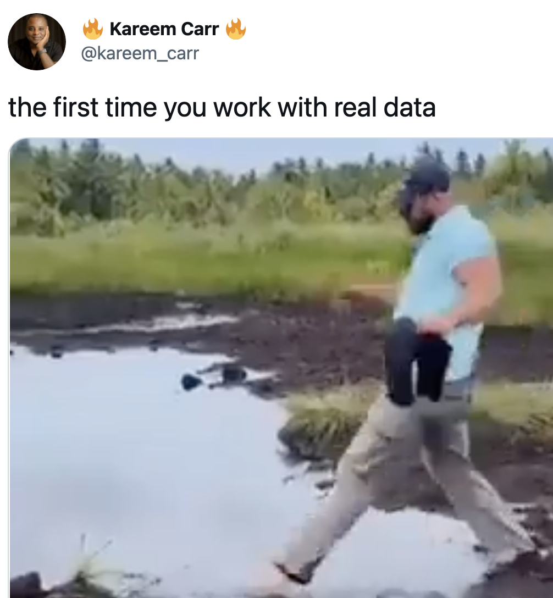

MSDS692 Data acquisition
=======

There are lots of exciting and interesting problems in data science, such as figuring out what the right question is, selecting features, training a model, and interpreting results. But all of that presupposes a tidy data set that is suitable for analysis or training models. Industry experts all agree that data collection and preparation is roughly 3/4 of any analysis effort. Or, as Kareem Carr puts it (I'm guessing he includes data acquisition and organization in the term "cleaning"):

<table border="0">
<tr valign="top" border="0">
<td border="0"></td><td border="0"></td>			
</tr>
</table>

The title of this course is "Data Acquisition" but of course, once we get the data, we have to organize it into handy data structures and typically have to extract information from the raw data. For example, we might need to boil down a Twitter stream into a single positive or negative sentiment score for a given user.  This course teaches you how to collect, organize, coalesce, and extract information from multiple sources in preparation for your analysis work. Along the way, you'll learn about the commandline, git, networks, the internet protocols, and building your own web servers.

This course is part of the [MS in Data Science program at the University of San Francisco](https://www.usfca.edu/arts-sciences/graduate-programs/data-science).

# Course details

**INSTRUCTOR.** [Terence Parr](http://parrt.cs.usfca.edu). I’m a professor in the computer science and [data science program](https://www.usfca.edu/arts-sciences/graduate-programs/data-science) departments and was founding director of the MS in Analytics program at USF (which became the MS data science program).  Please call me Terence or Professor (not “Terry”).

**OFFICE HOURS**

Terence is generally available on slack or email on-demand.

**SPATIAL COORDINATES:** 

* Downtown campus combined rooms 155-156 on main floor.
* My office is room 525 @ 101 Howard

**TEMPORAL COORDINATES.** Tue Aug 24, 2021 - Thur Oct 14, 2021 with 2 Sections of live lecture: 10am-11:50am and 1pm-2:50pm.  Morning lecture will be zoom recorded for any remaining remote students.

**INSTRUCTION FORMAT**. Live class runs for ~2 hours, 2 days/week. Instructor-student interaction during lecture is encouraged by speaking up in zoom. We'll often mix in mini-exercises / labs during class. All programming will be done in the Python 3 programming language, unless otherwise specified.

**LAPTOP POLICY.** My policy is that all student laptops must be closed during class unless we are doing a lab or I specifically ask you to follow along as I type into my computer. All materials for the course are available in this repository, which reduces your need to take notes considerably.

## Student evaluation

<!--
| Artifact | Grade Weight | Due date |
|--------|--------|--------|
|[Data pipeline](https://github.com/parrt/msds692/blob/master/hw/pipeline.md)| 5%| Thu, Oct 22 |
|[Search Engine Implementation](https://github.com/parrt/msds692/blob/master/hw/search.md)| 11% | Tue, Nov 3 |
|[TFIDF document summarization](https://github.com/parrt/msds692/blob/master/hw/tfidf.md)| 9%| Thu, Nov 12 |
|[Recommending Articles](https://github.com/parrt/msds692/blob/master/hw/recommender.md)| 7% | Thu, Nov 19 |
|[Tweet Sentiment Analysis](https://github.com/parrt/msds692/blob/master/hw/sentiment.md)| 9% | Thu, Dec 3 |
| [Code reviews](hw/code-review.ipynb) for 5 projects | 5% | Due 11:59PM on day associated project is due |
|Exam 1| 27%| 2-3:30PM Tue, Nov 10 and 12:01AM-1:31AM Nov 11 |
|Exam 2| 27%| 2-3:30PM Mon, Dec 7 and 12:01AM-1:31AM Dec 8|
-->

| Artifact | Grade Weight | Due date |
|--------|--------|--------|
|[Data pipeline](https://github.com/parrt/msds692/blob/master/hw/pipeline.md)| 5%| Tue, Aug 31, 1pm (start of section 2) |
|[Search Engine Implementation](https://github.com/parrt/msds692/blob/master/hw/search.md)| 12% | Tue, Sep 14, 1pm |
|[TFIDF document summarization](https://github.com/parrt/msds692/blob/master/hw/tfidf.md)| 10%| Thu, Sep 23, 1pm |
|[Recommending Articles](https://github.com/parrt/msds692/blob/master/hw/recommender.md)| 9% | Sat, Oct 2 11:59pm |
|[Tweet Sentiment Analysis](https://github.com/parrt/msds692/blob/master/hw/sentiment.md)| 9% | Tue, Oct 12 1pm |
|Exam 1| 25%| Thu, Sep 21 |
|Exam 2| 30%| Thu, Oct 14 |

*I reserve the right to change projects until the day they are assigned.*

All projects are **individual** projects not group efforts! All projects will be graded with the specific input or tests given in the project description, so you understand precisely what is expected of your program. Consequently, projects will be graded in binary fashion: They either work or they do not. The only exception is when your program does not run on the grader's or my machine because of some cross-platform issue. This is typically because a student has hardcoded some file name or directory into their program. In that case, we will take off *a minimum* of 10% instead of giving you a 0, depending on the severity of the mistake.  Some projects will be tested with some hidden unit tests; e.g., see the [evaluation section](https://github.com/parrt/msds692/blob/master/hw/search.md) of the search project.

Please go to github and verify that the website has the proper files for your solution. That is what I will download for testing.

Each project has a hard deadline and only those projects working correctly before the deadline get credit.  My grading script pulls from github at the deadline.

**No partial credit**. Students are sometimes frustrated about not getting partial credit for solutions they labored on that do not actually work. Unfortunately, "almost working" just never counts in a job situation because nonfunctional solutions have no value.  We are not writing essays in English that have some value even if they are not superb.  When it comes to software, there is no fair way to assign such partial credit, other than a generic 30% or whatever for effort.  The only way to determine what is wrong with your project is for me to fix and/or complete the project. That is just not possible for 90 students. Even if that were possible, there is no way to fairly assign partial credit between students.  A few incorrect but critical characters can mean the difference between perfection and absolute failure. If it takes a student 20 hours to find that problem, is that worth more or less partial credit than another project that is half-complete but could be finished in five hours? To compensate, I try to test multiple pieces of the functionality in an effort to approximate partial credit.

**Grading standards**. I consider an **A** grade to be above and beyond what most students have achieved. A **B** grade is an average grade for a student or what you could call "competence" in a business setting. A **C** grade means that you either did not or could not put forth the effort to achieve competence. Below **C** implies you did very little work or had great difficulty with the class compared to other students.

### Honorlock

All tests use **HonorLock** via Canvas and have strict time limits. You will be unable to do anything other than take the test; no access to the Internet etc.  A proctor will monitor you during exams to ensure you do not communicate with anyone else during the test. Generally speaking, HonorLock will record all your web, computer, and personal activities (e.g., looking at your phone) during the quiz. It will flag suspicious behavior for my review and will save the recordings for 6 months if I need to go back and check it.

Please see the [How to use" page for students](https://honorlock.kb.help/-students-starting-exam/how-to-use-honorlock-student/). Either I or another instructor will launch a practice quiz on Canvas during the first week of class to ensure everything is set up properly.

* Google Chrome and a webcam are required. At the beginning of the quiz, you will be able to add the Chrome extension for Honorlock, then follow the instructions to share your screen and record your quiz.
* You might be asked to change settings on your computer while doing this. You can change the setting and come back to the quiz. This change should only be expected once.
* If you are showing us the side view of your face we don’t know if you’ve got an earbud in your other ear. This is not allowed.  
* Make sure you are facing into the camera as Honorlock will shut down the system and force you to restart.
* Make sure that you are not looking down and to the right as if you are looking at notes or using your phone. Honorlock will flag this as cheating.
* You must not start and stop your browser; Honorlock will flag this is cheating.
* You must not use other applications or visit non-Canvas-quiz URLs during the exam unless the exam indicates this is permitted.
* Do not have your phone visible as the proctor will stop the quiz

Side notes:

* Start the quiz with a single Chrome window and single tab in that window.
* When the "share screen button" is grey, you can still click it and it will work.
* HonorLock flags activities other than the allowed ones: for example when you are accessing a website other than canvas or looking at your phone. I will evaluate these cases and make a judgment myself. I will reach out to you when necessary. If you have followed the guidelines, you don’t need to worry.
* If you have an honorlock software issue during the test, you must take a screen picture with your phone or ipad and notify me immediately via private slack to timestamp the situation with the picture and reason why you cannot proceed. Please contact tech support on the screen to resolve (they are very quick). I will check the Honorlock recording and timestamp of your pictures to grade. 
* [Privacy statement from HonorLock](https://honorlock.com/student-privacy-statement/) just in case you are worried about privacy. Since access to Honorlock is very limited, and you are expected to only work on the quiz during the proctoring time, the data that Honorlock records is very limited too. The data storage and sharing agreement don’t have a higher risk than your regular school actives (Zoom, email, Canvas, ...). 

# Syllabus

We're going to start the class with a cool [lab to extract coronavirus data from Wikipedia](notes/day-one-lab.ipynb).

## Tools

Before we get to the meat of the course, we need to get familiar with some important tools: the commandline (`Terminal.app`) and `git`.
 
* [The terminal command-line and python environments](https://github.com/parrt/msds692/blob/master/notes/terminal.pdf)  (Day 1)
* [Streams/pipes/redirection in the terminal](https://github.com/parrt/msds692/blob/master/notes/streams.pdf) (Day 2)
* [git and github version control](https://github.com/parrt/msds692/blob/master/notes/git.pdf) (Day 2)

## Organizing data in memory into structures

* [Hashtable implementations of sets and dictionaries](https://github.com/parrt/msds692/blob/master/notes/hashtable.pdf) (Day 3)
* [Search Engine Implementation](https://github.com/parrt/msds692/blob/master/hw/search.md) (**project**) (Day 3)

<!--
* [Review object definition / usage](notes/OO.ipynb) (Day 4)
-->

## Data formats

Most data you encounter will be in the form of human readable text, such as comma-separated value (CSV) files. We begin the course by studying how characters are stored in files and learning about the key data formats.

* [Data pipeline project](https://github.com/parrt/msds692/blob/master/hw/pipeline.md) (Converting stock history from Quandl to various formats) (**project**) (Day 1)
	* reading delimited data; tsv, csv
	* reading/generating XML (we'll load complicated XML in [TFIDF project](https://github.com/parrt/msds692/blob/master/hw/tfidf.md))
	* reading/generating json
* [Representing text in a computer](https://github.com/parrt/msds692/blob/master/notes/chars.pdf); see also [7-bit ascii codes](http://www.asciitable.com/), [unicode vs ascii in python](https://docs.python.org/3/howto/unicode.html) (Day 3)
* [Excel and CSV data](notes/excel.ipynb) (Day 4)
* [PDF using pdftotext](notes/pdf.ipynb) (Extracting text from Tesla's marketing brochure) (Day 4)
* [Manipulating text from the command line](notes/text-cmd-line.ipynb) (Day 4)
* [HTML](notes/html.ipynb) (Parsing Tesla's IPO prospectus) (Day 5)

There are also plenty of nontext, binary formats. You can learn more from the msds501 boot camp material for [audio processing](https://github.com/parrt/msds501/blob/master/notes/sound.ipynb) and [image processing](https://github.com/parrt/msds501/blob/master/projects/images.md).

* (code review of sample jsontable functions, more htable discussion)

## Text feature extraction

* [San Francisco police incidents word clouds](notes/sfpd-wordcloud.ipynb) (Day 5)
* [CSV command-line kung fu](notes/bashcsv.ipynb) (Day 5)
* [Intro to information extraction from text](notes/text.ipynb) (Day 6)
* [Spacy NLP library](notes/spacy.ipynb) (Day 6)
* [Computing TFIDF](notes/tfidf.pdf) (Day 6)
* [TFIDF notebook](notes/tfidf.ipynb)
* [TFIDF document summarization](https://github.com/parrt/msds692/blob/master/hw/tfidf.md) (**project**) (Day 6)

## How the web works

Now you know how to work with data files already sitting on your desk, we turn towards a study of computer networking and web infrastructure.

* [Network sockets](notes/sockets.md), DNS, email (Day 7)
* [client/server architecture](notes/client-server.md) (Day 7)
* [HTTP](notes/http.md) (Day 7)
* [flask](notes/flask.md) (Day 8)
* [Launch AWS box (MSDS501 notes)](https://github.com/parrt/msds501/blob/master/notes/aws.md), AWS launch notes from [Recommending Articles Project](https://github.com/parrt/msds692/blob/master/hw/recommender.md) (Day 9)
* [Building web servers](https://github.com/parrt/msds692/blob/master/hw/server.md) (**optional project**)
* [Web analytics](notes/webanalytics.md) (Day 10)
* [Cookies](notes/cookies.md), logging in/out (Day 11)

## Data sources

With an understanding of how the Internet and web works, it's time to start pulling data from various web sources.  The difficulty of collecting data depends a great deal on the permissions and services available for a site or page.  A good analogy is: some doors are open, some doors are closed, some doors are locked, some "doors" are not doors but reinforced steel walls.

* [Pulling data from (open) REST APIs](notes/openapi.ipynb) (Day 12)
  * openpayments.us (Day 12)
* [Pull data from sites requiring an API key](notes/apikey.ipynb)
  * Quandl stock data (Day 12)
  * OMDb movie data (Day 12)
  * [Zillow](notes/zillow.md) (Day 13)
  * [Youtube](notes/youtube.md) (Day 13)
* [APIs requiring authentication/identification](notes/authapi.md) (Optional)
  * [Twitter](notes/twitter.md)  ()
  * [LinkedIn](notes/linkedin.md) ()
  * [Facebook](notes/facebook.md) (Optional)
* [Extracting data from web pages](notes/scraping.md) (Day 14)
  * [Crawling](notes/crawling.md) (Day 14)
  * [buzzfeed](notes/buzzfeed.md) (Day 14)
  * [Amazon](notes/amazon.md) (Day 14)
  * [Scraping data from tables](notes/scraping-tables.md) (Day 14)
* [Selenium](notes/selenium.md) (Day 15)

## Misc

* [Car breakins in San Franciscoy heat map using Folium](notes/code/sfpd/sfo-heatmap.ipynb)
* [San Francisco police activity heat map using google map API](notes/heatmap-googleapi.md)
* [Debugging with PyCharm](notes/debugger.md)

## Administrative details

**ACADEMIC HONESTY.** You must abide by the copyright laws of the United States and academic honesty policies of USF. You may not copy code from other current or previous students. All suspicious activity will be investigated and, if warranted, passed to the Dean of Sciences for action.  Copying answers or code from other students or sources during a test, exam, or for a project is a violation of the university’s honor code and will be treated as such. Plagiarism consists of copying material from any source and passing off that material as your own original work. Plagiarism is plagiarism: it does not matter if the source being copied is on the Internet, from a book or textbook, or from tests or problem sets written up by other students. Giving code or showing code to another student is also considered a violation.

The golden rule: **You must never represent another person’s work as your own.**

If you ever have questions about what constitutes plagiarism, cheating, or academic dishonesty in my course, please feel free to ask me.

All students are expected to know and adhere to the University's <a href="https://usfca.edu/academic-integrity/">Honor Code</a>.

**Note:** Leaving your laptop unattended is a common means for another student to take your work. It is your responsibility to guard your work. Do not leave your printouts laying around or in the trash. *All persons with common code are likely to be considered at fault.*

**USF policies and legal declarations**

*Students with Disabilities*

If you are a student with a disability or disabling condition, or if you think you may have a disability, please contact <a href="https://www.usfca.edu/student-disability-services">USF Student Disability Services</a> (SDS) for information about accommodations.  Students should contact SDS at the beginning of the semester. **Accommodations are not retroactive.**

*Illnesses and Emergencies*

If you fall ill or have an emergency (personal or otherwise) that significantly affects your ability to complete a project or take an exam, you must notify the instructor before the task or artifact is due. Do not simply skip an exam or an assignment and say you were sick after the fact. Always make arrangements with the instructor beforehand, rather than declaring illness or emergency later. **Accommodations are not retroactive.**  Illness and emergency related situations must be disclosed to both the instructor and program director in writing. Illness-related issues must be accompanied by a doctor’s note.
  
*Behavioral Expectations*

All students are expected to behave in accordance with the <a href="https://usfca.edu/fogcutter">Student Conduct Code</a> and other University policies.

*Counseling and Psychological Services (CAPS)*

CAPS provides confidential, free <a href="https://usfca.edu/student-health-safety/caps">counseling</a> to student members of our community.

*Confidentiality, Mandatory Reporting, and Sexual Assault*

For information and resources regarding sexual misconduct or assault visit the <a href="https://myusf.usfca.edu/title-ix">Title IX</a> coordinator or USFs <a href="http://usfca.callistocampus.org" target="_blank">Callisto website</a>.
