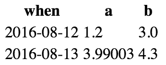
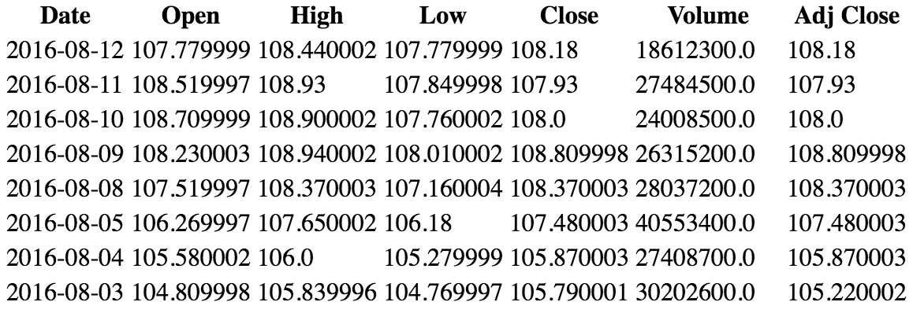
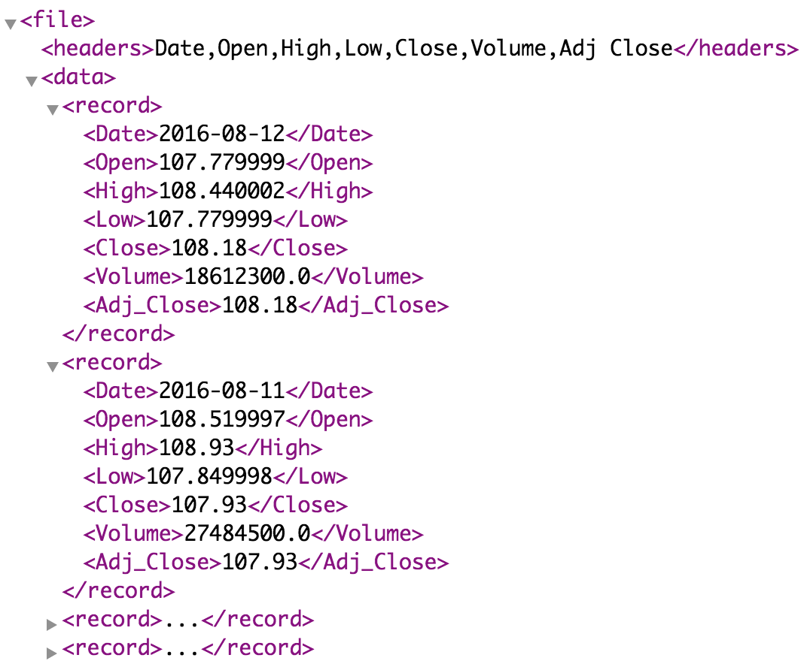
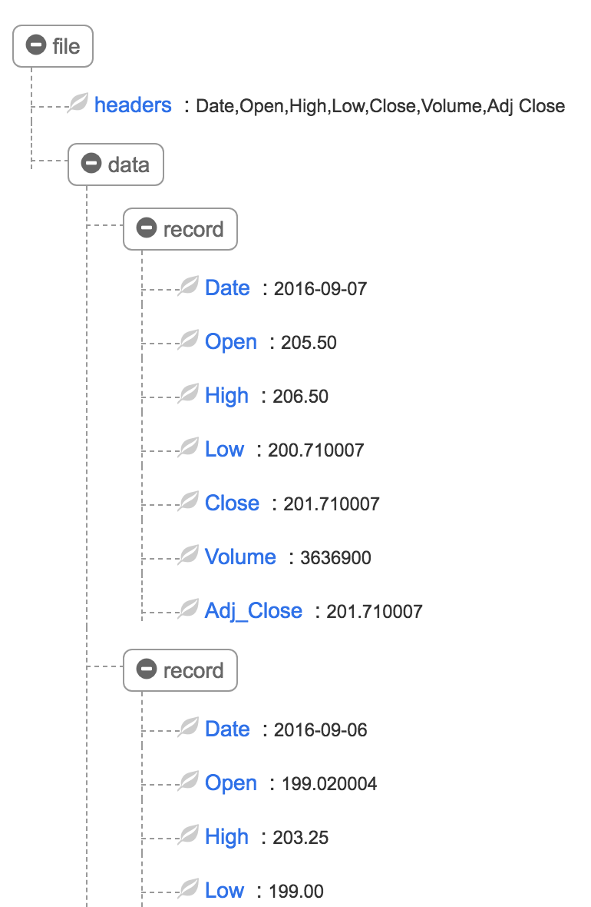

# Data translation pipeline

*All projects in this class are individual projects, not group projects.  You may not look at or discuss code with others until after you have submitted your own individual effort.*

## Goal

The goal of this  homework is to study the most common text-based data formats: `csv`, `xml`, `json`, and `html`.  Parsing data files can be tricky, but generating them is easy and teaches you to speak in those languages.  In this first homework, you will therefore be generating data in multiple formats but using standard Python libraries to read that data back in. The exception is that you will be parsing comma-separated value (CSV) files the hard way.  You will generate output using Python strings or a template engine like jinja2.

You will be working with Python scripts rather than notebooks because we want a set of executable commands.

The basic idea is that you will be able to read in some data in csv format and pass it  along a pipeline of data conversions, ultimately getting it back to the original format:


From the commandline, it will look like this:

```bash
$ cat data.csv | \
  python csv2xml.py | \
  python xml2csv.py | \
  python csv2json.py | \
  python json2csv.py > samedata.csv
$ diff data.csv samedata.csv | wc
       0       0       0
```

The `|` pipes the output of one command to the input of another. The `>` redirects the output of the command to a file. To learn about I/O redirection and pipes from the command line, see some of the tutorials, such as [Piping and Redirection](https://ryanstutorials.net/linuxtutorial/piping.php) and [An Introduction to Linux I/O Redirection](https://www.digitalocean.com/community/tutorials/an-introduction-to-linux-i-o-redirection).

The last command just checks to make sure that there is no difference between the original file and the data after it's been pushed through the pipeline.

Because these programs read and write to standard input and standard output, we can mix and match them from the commandline to translate from one format to the other. For example, here's how to translate xml to json:

```bash
$ cat data.xml | \
  python xml2csv.py | \
  python csv2json.py > data.json
```

The programs also know how to read from a file if one is specified:

```bash
$ python xml2csv.py data.xml | python csv2json.py > data.json
```

It's also good idea to learn how to generate HTML for display in a browser, so we will create a CSV to HTML translator as well.

You will work in git repo pipeline-*userid*.  Some [starter kit files](https://github.com/parrt/msds692/blob/master/hw/code/pipeline) are available.

## Description

### Getting some initial stock data

Grab Apple's 35 year stock history using this URL

```
http://ichart.finance.yahoo.com/table.csv?s=AAPL
```

*This API was taken down in 2017 so just grab [the file](https://github.com/parrt/msds692/blob/master/hw/code/pipeline/data/AAPL.csv) from the data dir of the course repo*. Or, register for an API key at [Quandl](https://blog.quandl.com/api-for-stock-data) and then use `https://www.quandl.com/api/v3/datasets/EOD/AAPL.csv?api_key=YOURAPIKEY`.

The data is a CSV file with 8996 lines, which we can discover easily with `wc`:
 
```bash
$ wc ~/github/msds692/data/AAPL.csv
    8996    8997  583817 /Users/parrt/github/msds692/data/AAPL.csv
```

The first thing to notice is that there is a header row that describes the data in the various columns.
 
```bash
$ head ~/github/msds692/data/AAPL.csv
Date,Open,High,Low,Close,Volume,Adj Close
2016-08-12,107.779999,108.440002,107.779999,108.18,18612300,108.18
2016-08-11,108.519997,108.93,107.849998,107.93,27484500,107.93
2016-08-10,108.709999,108.900002,107.760002,108.00,24008500,108.00
```

The data follows the header row, with one record per line. The key element of the CSV format is the separator, more specifically the venerable comma. It is the column or field separator that allows us to distinguish between the elements. For *m* columns, there are *m-1* separators. For *n* records, there are *n* lines (with possibly a header row in addition).

### Parsing simple CSV files

It's often best to start with a tiny input example before tackling a bigger data set. I made a small CSV file:
 
```csv
when,a,b
2016-08-12,1.2,3
2016-08-13,3.99003,4.3
```

To parse that, we read the file and convert it to a list of lines and then we split each line on commas. That gives us a list of lists. Of course, the first line of the file is special; it is the header row. Let's get this first task out of the way then by completing the following code in [mycsv.py](https://github.com/parrt/msds692/blob/master/hw/code/pipeline/mycsv.py) (a library to be used by your other files):

```python
import sys

def getdata():
    if len(sys.argv)==1: # if no file given, read from stdin
        data = sys.stdin.read()
    else:
        f = open(sys.argv[1], "r")
        data = f.read()
        f.close()
    return data.strip()

def readcsv(data):
    """
    Read CSV with header from data string and return a header list
    containing a list of names and also return the list of lists
    containing the data.
    """
    ...
    return header, data
```

Here is a sample Python test script that prints out the results of our `readcsv` function:

```python
import mycsv
header, data = mycsv.readcsv(mycsv.getdata())
print(header)
print(data)
```

Running with my simple test file, we'd generate this output:

```bash
$ python test_readcsv.py < testdata.csv
['when', 'a', 'b']
[['2016-08-12', '1.2', '3'], ['2016-08-13', '3.99003', '4.3']]
```

Or, if you want to go back to csv format, you could use the following Python code:

```python
print(f"header = {','.join(header)}")
for row in data:
    print(','.join(row))
```

Ok, so at this point, you can read in CSV files into a list of column names and a list of rows. The rest of the Python files will import `mycsv.py`.

**Note:** You should not be importing the standard `csv` Python package because I want you to learn to parse CSV yourself.

###  Generating HTML

Now that we have `mycsv.py`, we can use it to read in CSV and dump some sample output in HTML format. This is useful for viewing large tables because the browser knows how to scroll. It's also an opportunity to learn some more HTML.

From our sample test data file, you need to generate the following HTML:

```html
<html>
<body>
<table>
<tr><th>when</th><th>a</th><th>b</th></tr>
<tr><td>2016-08-12</td><td>1.2</td><td>3.0</td></tr>
<tr><td>2016-08-13</td><td>3.99003</td><td>4.3</td></tr>
</table>
</body>
</html>
```

which looks like this in a browser:



Of course our real data set is much bigger and the first part of it looks like this:



In file `csv2html.py`, write a small script that reads in the CSV using `getdata()` and then prints out an HTML `table`.  

You can use the template engine [jinja2](http://jinja.pocoo.org/docs/2.9/), which is part of the flask webserver that we will use later, or just slap together strings in order to create the HTML. Please do not use any other template engine because I might not have that installed when grading. 

The program should read from standard input or from a filename parameter to the script (this is handled automatically for you by `getdata()`):

```bash
$ python csv2html.py < testdata.csv > /tmp/t.html
$ python csv2html.py testdata.csv > /tmp/t.html
```

### Generating XML

One of the most common data formats you will run into is XML (HTML is like a specific kind of XML). There are begin and end tags that must match up. XML files also tend to start with information about the version: `<?xml version="1.0"?>`, so please put that in as well.

For the test file, the output should look like the following.

```xml
<?xml version="1.0"?>
<file>
  <headers>when,a,b</headers>
  <data>
    <record>
      <when>2016-08-12</when><a>1.2</a><b>3.0</b>
    </record>
    <record>
      <when>2016-08-13</when><a>3.99003</a><b>4.3</b>
    </record>
  </data>
</file>
```

**For evaluation purposes, you must follow the order shown in that XML. The records must be in the order of the rows found in the CSV and the order of the tag names must follow the columns found in the CSV.**

From within the chrome browser, the real XML data from the AAPL history looks like this (although I may have added an XML viewer plug into the browser):
 


*Please note that `Adj Close` is the proper name of the header, what you see in the `headers` tag. But, XML does not allow spaces in the name of the tag and so you must convert spaces to `_` characters as you see in the XML above.*

In file `csv2xml.py`, write a small script that reads in the CSV using `getdata()` and then prints out the data in XML. It also must specifically use the tags I have above: `file`, `headers`, `data`, `record`. Note that the `when` tag and the others within a record are not hardcoded: they depend on the headers from the CSV input.

Again, you can use the template engine [jinja2](http://jinja.pocoo.org/docs/2.9/) or just combine strings manually to generate XML.

The program should read from standard input or from a filename parameter to the script (this is handled automatically for you by `getdata()`:

```bash
$ python csv2xml.py < testdata.csv > /tmp/t.xml
$ python csv2xml.py testdata.csv > /tmp/t.xml
```

The header names could have spaces in them, which makes them not legal XML tag names.  Header names like `Adj Close` should be converted to use underscores: `Adj_Close` in the generated XML.

### Generating JSON

JSON, a format typically used for the transmission of JavaScript data objects, is also extremely popular. It is very similar to XML in that each data element is identified specifically. Naturally, JSON syntax looks quite different from XML but at an abstract level there very similar.

```json
{
  "headers":["when", "a", "b"],
  "data":[
    {
      "when":"2016-08-12", "a":"1.2", "b":"3"
    },
    {
      "when":"2016-08-13", "a":"3.99003", "b":"4.3"
    }
  ]
}
```

**For evaluation purposes, you must follow the order shown in that JSON. The records must be in the order of the rows found in the CSV and the order of the key names/data must follow the columns found in the CSV.**

You can add the Chrome extension [JSONView](https://chrome.google.com/webstore/detail/jsonview/chklaanhfefbnpoihckbnefhakgolnmc), by the way, so that you can view JSON in the browser nicely.  You can also use `jq` to view things from the commandline:


 
In file `csv2json.py`, write a small script that reads in the CSV using `getdata()` and then prints out the data in JSON. It also must specifically use the keys I have above: `headers`, `data`. Note that the `when` key and the others within a record are not hardcoded: they depend on the headers from the CSV input.

You can use the template engine [jinja2](http://jinja.pocoo.org/docs/2.9/) or just combine strengths manually to generate JSON. (Please limit yourself to anaconda standard libs.)

The program should read from standard input or from a filename parameter to the script (this is handled automatically for you by `getdata()`:

```bash
$ python csv2json.py < testdata.csv > /tmp/t.json
$ python csv2json.py testdata.csv > /tmp/t.json
```

### Reading XML Data

Parsing XML is beyond the scope of this class, but we still need to know how to use libraries that read this XML in. We're going to make a program called `xml2csv.py` that reads in XML and spits out CSV:
 
```bash
$ python xml2csv.py < /tmp/t.xml
```

There are a number of XML libraries for Python, but the simplest one to use is [untangle](https://github.com/stchris/untangle). You'll need to install `xmltodict ` as well as I use that for testing:

```bash
pip install untangle
pip install xmltodict
```

From some text, you can get a tree representation of the XML like this:

```python
xml = untangle.parse(xmltxt)
```

At this point, we need to know about the actual structure of the XML before we can pull data out. The root of the structure is the `file` tag so `xml.file` will get us that node in the tree. From there, you need to iterate over the `record` elements underneath the `data` tag. Pull out the individual values by their name such as `Date`.  Be careful how you fill in the CSV "table" for output: the order of the columns must be the order given in the headers tag.

Notice that there are no spaces in the tag names but the `headers` tag includes the real header names like `Adj Close`. You will have to take this into consideration when looking for tags in the XML.

We can visualize XML trees easily with [xmlviewer.org](http://www.xmlviewer.org/), such as the start of the Telsa data:
 


You can check your work with:
 
```bash
$ python xml2csv.py /tmp/t.xml | python csv2xml.py > /tmp/t2.xml
$ diff /tmp/t.xml /tmp/t2.xml
```

### Reading JSON data

Parsing JSON is also beyond the scope of this class, but we still need to know how to use libraries that read this JSON in. We're going to make a program called `json2csv.py` that reads in JSON and spits out CSV:
 
```bash
$ python json2csv.py < /tmp/t.json
```

The standard `json` Python library works well. You can get a (possibly nested) dictionary from some JSON text with this:

```python
data = json.loads(jsontxt)
```

As with XML, we need to know the structure of the JSON "object" in order to pull data out of it. For example, you can pull out the headers like this:

```python
headers = data['headers']
```

Using the debugger, you can examine the various components of the `data` `dict`. I highly recommend you do that to orient yourself with the structure of the object.
 
You can check your work with:
 
```bash
$ python json2csv.py /tmp/t.json | python csv2json.py > /tmp/t2.json
$ diff /tmp/t.json /tmp/t2.json
```

## Deliverables

In your repo root directory, please add:

* mycsv.py
* csv2html.py
* csv2xml.py
* csv2json.py
* json2csv.py
* xml2csv.py

You shouldn't add data to the repo. We'll test it using [sample input](https://github.com/parrt/msds692/blob/master/hw/code/pipeline/data) and compare to [expected output](https://github.com/parrt/msds692/blob/master/hw/code/pipeline/output).

Please be aware that the point of this exercise is to teach you about generating structured text.  There are plenty of libraries out there already that will generate data in any format we want. Please don't call them because, unless directed to in the notes above. Otherwise you are not actually solving the problem but rather simply calling somebody else's solution. Learning a language is a matter of learning to speak it and it defeats the purpose of this exercise if you call someone else's JSON or XML dumping routine.

## Evaluation

Each of the five translators will be tested automatically. Any programming errors or invalid output will result in a zero for that particular test. Each of the translators gets 20% of the score.  Note, however, that if your CSV `readcsv()` function doesn't work, your `csv*.py` scripts will not work either so make sure you get that working correctly first.

You will find some [sample input](https://github.com/parrt/msds692/blob/master/hw/code/pipeline/data) and [expected output](https://github.com/parrt/msds692/blob/master/hw/code/pipeline/output) in this course repository.

I provide a [test shell script](https://github.com/parrt/msds692/blob/master/hw/code/pipeline/testdata.sh) that you can use to test your data format generation and conversion.  Your project will be graded by running the AAPL, TSLA, and simple t data files:

```bash
$ ./testdata.sh data output
Test AAPL
   csv2html: output/AAPL.html and /tmp/AAPL.html same
   csv2xml: output/AAPL.xml and /tmp/AAPL.xml same
   csv2json: output/AAPL.json and /tmp/AAPL.json same
   xml2csv: data/AAPL.csv and /tmp/AAPL.csv same
   json2csv: data/AAPL.csv and /tmp/AAPL.csv same
   xml2csv|csv2xml: output/AAPL.xml and /tmp/AAPL.xml same
   json2csv|csv2json: output/AAPL.json and /tmp/AAPL.json same
Test TSLA
   csv2html: output/TSLA.html and /tmp/csv2html-TSLA.html same
   csv2xml: output/TSLA.xml and /tmp/csv2xml-TSLA.xml same
   csv2json: output/TSLA.json and /tmp/csv2json-TSLA.json same
   xml2csv: input/TSLA.csv and /tmp/xml2csv-TSLA.csv same
   json2csv: input/TSLA.csv and /tmp/json2csv-TSLA.csv same
   xml2csv|csv2xml: output/TSLA.xml and /tmp/xml2csv-csv2xml-TSLA.xml same
   json2csv|csv2json: output/TSLA.json and /tmp/json2csv-csv2json-TSLA.json same
Test t
   csv2html: output/t.html and /tmp/t.html same
   csv2xml: output/t.xml and /tmp/t.xml same
   csv2json: output/t.json and /tmp/t.json same
   xml2csv: data/t.csv and /tmp/t.csv same
   json2csv: data/t.csv and /tmp/t.csv same
   xml2csv|csv2xml: output/t.xml and /tmp/t.xml same
   json2csv|csv2json: output/t.json and /tmp/t.json same
```

When testing, the `data` dir should have files AAPL.csv, TSLA.csv, and t.csv. When testing, the `output` directory is some place where your program can write files. After testing, it should contain the [expected output](https://github.com/parrt/msds692/tree/master/hw/code/pipeline/output).

To get credit for the various deliverables, all related tests must pass, as shown here.
