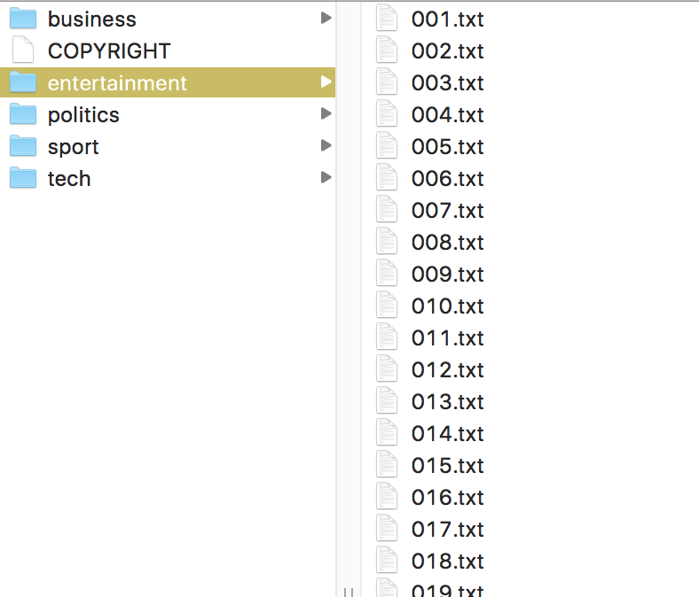

# Recommending Articles

*All projects in this class are individual projects, not group projects.  You may not look at or discuss code with others until after you have submitted your own individual effort.*

*todo: add arg data types and data class for an article object*

The goal of this project is to learn how to make a simple article recommendation engine using a semi-recent advance in natural language processing called [word2vec](http://arxiv.org/pdf/1301.3781.pdf) (or just *word vectors*). In particular, we're going to use a "database" from [Stanford's GloVe project](https://nlp.stanford.edu/projects/glove/) trained on a dump of Wikipedia. The project involves reading in a database of word vectors and a corpus of text articles then organizing them into a handy table (list of lists) for processing.

Around the recommendation engine, you are going to build a web server that displays a list of [BBC](http://mlg.ucd.ie/datasets/bbc.html) articles for URL `http://localhost:5000` (testing) or whatever the IP address is of your Amazon server (deployment):


Clicking on one of those articles takes you to an article page that shows the text of the article as well as a list of five recommended articles:


You will do your work in `recommender-`*userid*.

## Discussion

### Article word-vector centroids

Those of you who were not in the [MSDS501 computational boot camp](https://github.com/parrt/msds501) should read the project description [Word similarity and relationships](https://github.com/parrt/msds501/blob/master/projects/wordsim.md). The document explains word vectors enough to complete this project.

In a nutshell, each word has a vector of, say, 300 floating-point numbers that somehow capture the meaning of the word, at least as it relates to other words within a corpus. These vectors are derived from a neural network that learns to map a word to an output vector such that neighboring words in some large corpus are close in 300-space. ("The main intuition underlying the model is the simple observation that ratios of word-word co-occurrence probabilities have the potential for encoding some form of meaning." see [GloVe project](https://nlp.stanford.edu/projects/glove/).)

Two words are related if their word vectors are close in 300 space. Similarly, if we compute the centroid of a document's cloud of word vectors, related articles should have centroids close in 300 space. Words that appear frequently in a document push the centroid in the direction of that word's vector. The centroid is just the sum of the vectors divided by the number of words in the article. Given an article, we can compute the distance from its centroid to every other article's centroid. The article centroids closest to the article of interest's centroid are the most similar articles. Surprisingly, this simple technique works well as you can see from the examples above.

Given a word vector filename, such as `glove.6B.300d.txt`, and the root directory of the BBC article corpus, we will use the following functions from `doc2vec.py` in the main `server.py` file to load them into memory:

```python
# get commandline arguments
i = sys.argv.index('server:app')
glove_filename = sys.argv[i+1]
articles_dirname = sys.argv[i+2]
```

The `gloves` variable is the dictionary mapping a word to its 300-vector vector. The `articles` is a list of records, one for each article. An article record is just a list containing the fully-qualified file name, the article title, the text without the title, and the word vector computed from the text without the title.

Then to get the list of most relevant five articles, we'll do this:

```python
seealso = recommended(doc, articles, 5)
```

The description of those functions is in `doc2vec.py` from the starter kit, but it's worth summarizing them here:

```python
def load_articles(articles_dirname, gloves):
    """
    Load all .txt files under articles_dirname and return a table (list of tuples)
    where each record is a list of:

      (filename, title, article-text-minus-title, wordvec-centroid-for-article-text)

    We use gloves parameter to compute the word vectors and centroid.

    The filename is stripped of the prefix of the articles_dirname pulled in as
    script parameter sys.argv[2]. E.g., filename will be "business/223.txt"
    """
    ...
```
 
```python
def recommended(article, articles, n):
    """
    Return a list of the n articles (records with filename, title, etc...)
    closest to article's word vector centroid. The article is one of the elements
    (tuple) from the articles list.
    """
    ...
```

### Efficiency of loading the glove file

It's important to be efficient with memory usage when loading the glove file because as a process runs out of memory it starts to slow down. We call this thrashing because it is swapping things in and out of memory to the disk and back to try to operate within the constraints given to it. For example, don't use list and dictionary comprehensions to split up the glove file as it will require too much memory. (t2.medium machines at Amazon only have 4G RAM). Instead, process the glove file one line at a time and build the dictionary in that loop; for example:

```
d = {}
for line in f.readlines():
    d[...] = ...
```

If your system requires too much memory, your Amazon server will appear to freeze and not respond because it is taking too much time to process the glove file.
 
### Testing your library

At this point you should test your library. There's no point in trying to build a server that uses this library if we're not confident it works. It is much easier to debug a simple main program rather than a web server.  For example, with a main in `doc2vec.py`, you can run it like this:

```bash
python doc2vec.py ~/data/glove.6B/glove.6B.300d.txt ~/github/msds692/bbc
```

Here is the start of a suitable main:

```python
if __name__ == '__main__':
    glove_filename = sys.argv[1]
    articles_dirname = sys.argv[2]

    gloves = load_glove(glove_filename)
    articles = load_articles(articles_dirname, gloves)
    
    print(gloves['dog'])
    ...
```


### Web server

Besides those core functions, you need to build a web server as well using flask. See the video on [how to launch a flask web server at Amazon](https://www.youtube.com/watch?v=qQncEJL6NHs&t=156s) that I made, but which uses the simple flask web server not gunicorn. We need to use [gunicorn](http://gunicorn.org/) because the "... *Flask’s built-in server is not suitable for production as it doesn’t scale well and by default serves only one request at a time.*" (from the doc). See [Standalone WSGI Containers](http://flask.pocoo.org/docs/1.0/deploying/wsgi-standalone/) for more on using flask with gunicorn. The server should respond to two different URLs: the list of articles is at `/` and each article is at something like `/article/business/353.txt`. The BBC corpus in directory `bbc` is organized with topic subdirectories and then a list of articles as text files:



So, if you are testing and from your laptop, you would go to the following URL in your browser to get the list of articles:

`http://localhost:5000/`

And to get to a specific article you would go to:

`http://localhost:5000/article/business/030.txt`

The `localhost:5000` will be replaced with an IP address plus `:5000' or some machine name given to you by Amazon when you deploy your server.

For display purposes, I have given you some CSS to make the pages look good and to have the recommendation box on the right side gutter.   Please figure out how to use font size 70% and font family Verdana, sans-serif for the text just like you see in the examples at the start of this document.

The `server.py` file contains flask "routes" for the necessary URLs. You just have to fill in those functions:

```Python
@app.route("/")
def articles():
    """Show a list of article titles"""
```

```Python
@app.route("/article/<topic>/<filename>")
def article(topic,filename):
    """
    Show an article with relative path filename.
    Assumes the BBC structure of topic/filename.txt
    so our URLs follow that.
    """
```    

Also note that we are using the template engine [jinja2](http://jinja.pocoo.org/docs/2.9/) that is built-in with flask. When you call `render_template()` from within a flask route method, it looks in the `templates` subdirectory for the file indicated in that function call. You need to pass in appropriate arguments to the two different page templates so the pages fill with data.

Now that we are using green unicorn, you don't want to use `app.run()` anymore in your server.py file. Also note that using `-D` option on green unicorn makes it create a daemon process sitting in the background. To kill all of those processes you need to do a few steps:

```bash
beast:master:~/courses/msds692-private/hw/recommender $ gunicorn -D --threads 1 -b 0.0.0.0:5000 --access-logfile server.log --timeout 60 server:app ~/data/glove.6B/glove.6B.50d.txt ~/github/msds692/data/bbc

beast:master:~/courses/msds692-private/hw/recommender $ ps aux | grep gunicorn
parrt            71972   0.0  0.0  4267768   1028 s003  S+   11:01AM   0:00.00 grep gunicorn
parrt            71743   0.0  1.1  4657032 354216   ??  S    11:01AM   0:06.19 /Users/parrt/anaconda3/bin/python /Users/parrt/anaconda3/bin/gunicorn -D --threads 1 -b 0.0.0.0:5000 --access-logfile server.log --timeout 60 server:app /Users/parrt/data/glove.6B/glove.6B.50d.txt /Users/parrt/github/msds692/data/bbc
parrt            71737   0.0  0.0  4310344  10396   ??  S    11:01AM   0:00.02 /Users/parrt/anaconda3/bin/python /Users/parrt/anaconda3/bin/gunicorn -D --threads 1 -b 0.0.0.0:5000 --access-logfile server.log --timeout 60 server:app /Users/parrt/data/glove.6B/glove.6B.50d.txt /Users/parrt/github/msds692/data/bbc

beast:master:~/courses/msds692-private/hw/recommender $ kill -9 71737

beast:master:~/courses/msds692-private/hw/recommender $ kill -9 71743

beast:master:~/courses/msds692-private/hw/recommender $ ps aux | grep gunicorn
parrt            72120   0.0  0.0  4267768   1028 s003  S+   11:02AM   0:00.00 grep gunicorn
```

As you can see, all of the processes for `gunicorn` are now dead. You kill the process ID to make them stop (the number in the second column from `ps`).

### Your server will be attacked

*we moved back to port 5000 this year so this should not be an issue*

"Don't panic!" When you leave your web server up at port 80 for more than a few minutes, you will see people from around the web try to break into your computer. For example, you will see URLs like `/mysql/admin/`, `/phpmyadmin/`, `/dbadmin/`, `/mysql/`. The attacker is trying to use known exploits or default passwords for these various kinds of servers hoping to get in. You will see log entries printed from your flask server that look like this (138.202.1.109 was me):

```
$ gunicorn -D --threads 4 -b 0.0.0.0:80 --access-logfile server.log --timeout 60 server:app glove.6B.300d.txt bbc
 * Running on http://0.0.0.0:80/ (Press CTRL+C to quit)
138.202.1.109 - - [20/Sep/2017 20:02:45] "GET / HTTP/1.1" 200 -
138.202.1.109 - - [20/Sep/2017 20:03:07] "GET / HTTP/1.1" 200 -
138.202.1.109 - - [20/Sep/2017 20:03:09] "GET / HTTP/1.1" 200 -
138.202.1.109 - - [20/Sep/2017 20:10:20] "GET / HTTP/1.1" 200 -
89.133.128.188 - - [20/Sep/2017 20:12:31] "HEAD http://174.129.105.171:80/dbadmin/ HTTP/1.1" 404 -
89.133.128.188 - - [20/Sep/2017 20:12:32] "HEAD http://174.129.105.171:80/pma/ HTTP/1.1" 404 -
89.133.128.188 - - [20/Sep/2017 20:12:32] "HEAD http://174.129.105.171:80/db/ HTTP/1.1" 404 -
89.133.128.188 - - [20/Sep/2017 20:12:32] "HEAD http://174.129.105.171:80/admin/ HTTP/1.1" 404 -
89.133.128.188 - - [20/Sep/2017 20:12:32] "HEAD http://174.129.105.171:80/mysql/ HTTP/1.1" 404 -
89.133.128.188 - - [20/Sep/2017 20:12:33] "HEAD http://174.129.105.171:80/database/ HTTP/1.1" 404 -
89.133.128.188 - - [20/Sep/2017 20:12:33] "HEAD http://174.129.105.171:80/db/phpmyadmin/ HTTP/1.1" 404 -
89.133.128.188 - - [20/Sep/2017 20:12:33] "HEAD http://174.129.105.171:80/db/phpMyAdmin/ HTTP/1.1" 404 -
89.133.128.188 - - [20/Sep/2017 20:12:33] "HEAD http://174.129.105.171:80/sqlmanager/ HTTP/1.1" 404 -
...
```

It only took 7 minutes for the server to be attacked. It was attacked by four others within a few minutes. Naturally none of the attackers broke in because my flask server doesn't support any of those URLs. According to `whois`, the IP addresses of those connecting to my server were from Austria, India, Hungary, some local Comcast customer, and Australia.  Naturally the attacker is probably exploiting a machine or a proxy in those locations and is in some other location.

Anyway, the upshot is you don't have to worry about these attacks but it's something interesting to be aware of. The Internet is constantly being swept by target acquisition radar. Any server that opens up a port through the firewall will start getting hit almost immediately.

## Getting started

Download the [starterkit](https://github.com/parrt/msds692/tree/master/hw/code/recommender), which has the following files and structure:

```
├── doc2vec.py
├── server.py
└── templates
    ├── article.html
    └── articles.html
```

There are predefined functions with comments indicating the required functionality.

## Launching your server at Amazon

Creating a server that has all the appropriate software can be tricky so I have recorded a sequence that works for me.

The first thing is to launch a server with different software than the simple  Amazon linux we have been using in class. We need one that has, for example, `numpy` and friends so let's use an *image* (snapshot of a disk with a bunch of stuff installed) that already has machine learning software installed.  As of August 2019, the following sequence works. Select a t2.medium instance with "*Deep Learning AMI (Ubuntu) Version 24.0 - ami-004852354728c0e51*".  Create a `t2.medium` size computer (in Oregon; it's cheaper)!  The cost is 0.047 dollars per Hour, which is only 1.12 dollars per day.

Here's how I login:
 
```bash
$ ssh -i "parrt.pem" ubuntu@somemachineIPorname
```

Then from that remote machine:

```bash
source activate pytorch_p36
pip install --upgrade pip
pip install numpy Flask
conda install gunicorn # regular pip install won't work it seems
```

It seems to want `python3` not `python` as the Python executor name.  Numpy and friends should be installed already:

```bash
(pytorch_p36) ubuntu@ip-172-30-0-156:~$ python3
Python 3.6.5 |Anaconda, Inc.| (default, Apr 29 2018, 16:14:56) 
[GCC 7.2.0] on linux
Type "help", "copyright", "credits" or "license" for more information.
>>> import numpy as np
```

After logging in, clone your repository into the home directory:

```bash
cd ~
git clone https://github.com/USF-MSDS692/recommender-parrt.git
cd recommender-parrt
```

Now, download the data you need and unzip:

```bash
wget https://s3-us-west-1.amazonaws.com/msan692/glove.6B.300d.txt.zip
wget https://s3-us-west-1.amazonaws.com/msan692/bbc.zip
unzip glove.6B.300d.txt.zip
unzip bbc.zip
```

You should now be able to run your server:

```bash
$ gunicorn -D --threads 4 -b 0.0.0.0:5000 --access-logfile server.log --timeout 60 server:app glove.6B.300d.txt bbc
```

All output goes into `server.log`, even after you log out. The `-D` means put the server in daemon mode, which runs the background. During development, it's a good idea to not use that `-D` option so that error messages come to the standard output.

Don't forget to open up port 5000 in the firewall for the server so that the outside world can access it. Make sure that you test from your laptop!

Make sure the `IP.txt` file as the **public** IP address of your server with `:5000` on the line by itself, such as `54.198.43.135:5000`!

## Deliverables

### Github

In your github repository, you should submit the following:

* IP.txt; this is a single line text file terminated by a newline character that indicates the machine name or IP address of your server at Amazon
* doc2vec.py; implement `words()`, `doc2vec()`, `distances()`, `recommended()`
* server.py; implement `articles()`, `article()` flask routes
* templates/articles.html; use template language to generate the right HTML for the main list of articles page
* templates/article.html; use template language to generate the right HTML for an article page

**Please do not add data files such as the word vectors or the BBC corpus to your repository!**

### AWS

As part of your submission, you must launch a Linux instanceBig enough to hold the 300-vectors  at Amazon and install your software + necessary data. Then launch your server and keep it running for the duration of our grading period. We will notify you when it's okay to terminate that instance. Choose a server that is only about 5 cents per hour (either medium or large; not sure).

Here is how I launch my server on AWS (see above) or locally:
 
```bash
$ gunicorn -D --threads 4 -b 0.0.0.0:5000 --access-logfile server.log --timeout 60 server:app glove.6B.300d.txt bbc
```

All output goes into `server.log`, even after you log out. The `-D` means put the server in daemon mode (the background).  It means we can still access the Web server even though you are not connected with ssh.

Note that I you must give fully-qualified pathnames to the word vectors and the root of the BBC article corpus, if they are not in the same directory.

## Evaluation

To evaluate your projects, the grader and I will run the [test_server.py](https://github.com/parrt/msds692/blob/master/hw/code/recommender/test_server.py) script, from your repo root directory, that automatically pulls your article list page and a selection of article pages to check that your recommendations match our solution.

**Without the IP.txt file at the root of your repository, we cannot test your server and you get a zero!**  Our script reads your IP.txt file with:

`with open("IP.txt") as f: host = f.read().strip()`

The starterkit has `localhost:5000` in it so you can test locally before deploying to your server. You must replace `localhost` with the **public** IP address of your server.

It also reads some pickled "truth" data structures that encode the articles from my solution's web server. That data was generated with [pickle_truth.py](https://github.com/parrt/msds692/blob/master/hw/code/recommender/pickle_truth.py).

Here is a sample test run:

```bash
$ cd ~/grading/MSDS692/recommender-parrt
$ python -m pytest -v test_server.py
============================================ test session starts =============================================
platform darwin -- Python 2.7.12, pytest-2.9.2, py-1.4.31, pluggy-0.3.1 -- /Users/parrt/anaconda2/bin/python
cachedir: .cache
rootdir: /Users/parrt/grading/MSDS692/recommender-parrt, inifile: 
collected 2 items 

test_server.py::test_links PASSED
test_server.py::test_sample_articles PASSED

========================================== 2 passed in 0.57 seconds ==========================================
```

*Getting the article list right is worth 20% and getting the recommended articles right is worth 80%.* As you have the complete test, you should be able to get it working and we will grade in binary fashion (works or it doesn't).

*Make sure that your web server process is still running after you break the `ssh` connection by using a browser to connect at your server's public IP address*.
