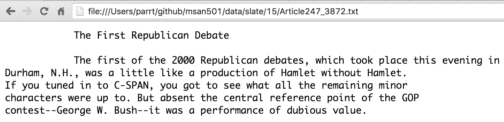

# Search Engine Implementation

*All projects in this class are individual projects, not group projects.  You may not look at or discuss code with others until after you have submitted your own individual effort.*

The goal of this project is to learn how hashtables work and to *feel* just how much slower a linear search is. Along the way, you'll learn the basic mechanics of implementing a search engine, including displaying search results in a browser window and being able to navigate to documents. You'll also learn a tiny bit of HTML.

## Discussion

A **search engine** accepts one or more **terms** and searches a corpus for files matching all of those terms.  A **corpus** is just a directory and possibly subdirectories full of text files. If you go to the [American National corpus](http://www.anc.org/data/oanc/contents/), you'll see lots of fun text data. I have extracted articles from [Slate](https://github.com/parrt/msds692/blob/master/data/slate.7z) magazine and also from [Berlitz travelogues](https://github.com/parrt/msds692/blob/master/data/berlitz1.7z).  These are your data sets.  Berlitz is smaller and so I use that in some of my [unit tests in the starterkit](https://github.com/parrt/msds692/tree/master/hw/code/search).  Here is a fragment of a sample search results page as displayed in Chrome (activated from Python); clicking on a link brings up the actual file.

| HTML output        | File Content |
| ---------- | -----
|  ||

In repo `search-`*userid*, you're going to implement 3 different search mechanisms using code derived from the [starter kit files](https://github.com/parrt/msds692/tree/master/hw/code/search). The actual search   mechanism of your code goes in these three files:

1. Linear search; file [linear_search.py](https://github.com/parrt/msds692/tree/master/hw/code/search/linear_search.py)
2. Hashtable via built in Python `dict` objects; file [index_search.py](https://github.com/parrt/msds692/tree/master/hw/code/search/index_search.py)
3. Hashtable that you implement yourself; file [myhtable_search.py](https://github.com/parrt/msds692/tree/master/hw/code/search/myhtable_search.py)

All three mechanism should give exactly the same results, but you will notice that the linear search is extremely slow. On my really fast machine with an SSD, it takes about five seconds to search through the Slate data. It has to open and search about 4500 files. With either of the hash tables, it's a matter of milliseconds. It's slow the first time you load all of the files regardless of the technique, but the indexed search is walking all of the files the first time only.

File [search.py](https://github.com/parrt/msds692/tree/master/hw/code/search/search.py) is the main program, which you execute like this from the `search-`*userid* directory:

```bash
$ python search.py linear ~/data/slate
$ python search.py index ~/data/slate
$ python search.py myhtable ~/data/slate
```

assuming you have placed the `slate` directory under a `data` directory in your home directory.

Here is what the program looks like in action:

```bash
$ python search.py linear ~/data/slate
4530 files
Search terms: Reagan Iran
```

After you enter the search terms and hit return, the Python program pops up your default browser on the HTML file you have just generated as a result of the search.

**Please do not add data files to your repository!** I don't need them and it takes forever to download your repos if you add the data. 

### Linear search

Your first task is to perform a brain-dead linear search, which looks at each file in turn to see if it contains all of the search terms. If it does, that filename is included in the list (not `set`) of matching documents. (Function `results()` expects a list, not a set.) The time complexity is *O(kn)* for an average of *k* words per file and *n* files; still, it is about *O(n)*: the order of the number of files.

Given a list of fully-qualified filenames for files containing the search terms, the main program in [search.py](https://github.com/parrt/msds692/tree/master/hw/code/search/search.py) uses function `results()` to get a string containing HTML, which `search.py` writes to file `/tmp/results.html`. It then requests, via `webbrowser.open_new_tab()`, that your default browser open that page.

### HTML output

You can create whatever fancy HTML you want to show search results, but here is the basic form you should follow:

```
<html>
    <body>
    <h2>Search results for <b>ronald reagan</b> in 164 files</h2>
    
        <p><a href="file:///Users/parrt/github/msds692/data/slate/51/ArticleIP_38825.txt">/Users/parrt/github/msds692/data/slate/51/ArticleIP_38825.txt</a><br>
         such barry goldwater and <b>ronald</b> <b>reagan</b> gradually that conservatism has<br><br>
        
        <p><a href="file:///Users/parrt/github/msds692/data/slate/50/ArticleIP_27730.txt">/Users/parrt/github/msds692/data/slate/50/ArticleIP_27730.txt</a><br>
         united states should pull out unilaterally when <b>ronald</b> <b>reagan</b> saw that had<br><br>
        
        <p><a href="file:///Users/parrt/github/msds692/data/slate/20/Article247_4335.txt">/Users/parrt/github/msds692/data/slate/20/Article247_4335.txt</a><br>
         will lead any good when <b>ronald</b> <b>reagan</b> introduced similar device his<br><br>  
...    
</body>
</html>
```      

Notice that the links are URLs just like you see going to websites except they refer to a file on the local disk instead of another machine because of the `file://` prefix.  For example, if my data is in the `github/msds692/data` subdirectory of my home directory, we see URLs like:
 
```
file:///Users/parrt/github/msds692/data/slate/10/Article247_3363.txt
```

(My data is stored in a slightly different spot than yours will be.)

Also notice that in my search results, I am showing up to 2 lines containing at least one of the search term(s). You must also wrap any search terms in `<b>` (bold) tags.

You can use the template engine [jinja2](http://jinja.pocoo.org/docs/2.9/), which is part of the flask webserver that we will use later, or just slap together strings in order to create the HTML.

### Creating an index using `dict`

Rather than looking through each file for every search, it's better to create a fast lookup index that maps a word to all of the files that contain that word. To compute the search results for multiple words, find the intersection of documents among the document set (`index[w]`) for each word. The resulting set will be just the documents that have all words.  `index[w]` returns a set (or unique list) of integers representing document indexes into your document list, `files`. In this way we don't have to duplicate the string for filenames in all of the `index` values. You can then convert a set of file indexes to filenames using the `files` list created during index creation.

It takes about the same time to create the index as it does to do one linear search because both are linearly walking through the list of files. The complexity of index creation is *O(n)* for *n* total words in all files. BUT, searching takes just *O(1)*, or constant time, once we have the index.  

The main program uses the following sequence for this `dict` version of the search engine:

```python
index = create_index(files) # files is a list of fully-qualified filenames
docs = index_search(files, index, terms) # terms is a list of normalized words
```

Once the index is created, function `index_search()` can crank out search results faster than you can take your fingers off the keyboard.

Here are the two key methods you must implement:
 
```python
def create_index(files):
    """
    Given a list of fully-qualified filenames, build an index from word
    to set of document IDs. A document ID is just the index into the
    files parameter (indexed from 0) to get the file name. Make sure that
    you are mapping a word to a set of doc IDs, not a list.
    For each word w in file i, add i to the set of document IDs containing w
    Return a dict object mapping a word to a set of doc IDs.
    """
```

```python
def index_search(files, index, terms):
    """
    Given an index and a list of fully-qualified filenames, return a list of
    filenames whose file contents has all words in terms parameter as normalized
    by your words() function.  Parameter terms is a list of strings.
    You can only use the index to find matching files; you cannot open the files
    and look inside.
    """
```

These functions will use expressions like `index[w]`, where `index` is a `dict`, to get the document IDs containing word `w`.

### Creating an index using your own hashtable

We know that a linear search of a list of associations is slow because it requires a search through all associations, in the worst case. But how can we find something without looking through all the items?

Imagine our goal is to find a particular person Eric Erickson in the United States. [Where would you look first](https://blogs.ancestry.com/cm/whats-the-most-popular-surname-in-your-state/)? Southern California or Minnesota? It turns out that people that immigrated to the United States tended to cluster in regions where they had family or friends from the old country. There were a lot of Scandinavians that moved to Minnesota and because of its proximity to Mexico, there are many people with Spanish last names in Southern California. That gives us a clue about how we might speed up the search.  Something about the key gives us a clue about how to restrict the region(s) where we need to look. Imagine that a person's name uniquely told you in which state they live. That would mean searching only roughly 300M / 50 people instead of all 300M given no knowledge about the keys.

A **hashtable** is a dictionary implementation that relies on this strategy to dramatically speed up key lookups by constraining the size of the search region.  A hashtable is a list of buckets and a bucket is a list of associations mapping an arbitrary key to arbitrary value.  The only real restriction is that the key must be immutable such as a string, a number, tuple, etc... We compute a function, a **hash function**, on the key that indicates which bucket (number) potentially contains the search key. With a uniform distribution, we would expect roughly *N*/*B* associations in each bucket for *B* buckets and *N* total elements in the dictionary.  A complexity of *N*/*B* is much better than *N* and, with sufficiently large *B*, we would say that *N*/*B* approaches 1, giving complexity *O(1)* versus *O(n)*.

Because we are not currently studying the object-oriented aspects of Python, we are going to represent a hashtable as a list of lists (list of buckets):

```python
def htable(nbuckets):
    """Return a list of nbuckets empty lists"""
```

The number of buckets should be a prime number to avoid hash code collisions. In memory, the empty hash table looks like (with 5 buckets):


Let's look at an example that adds something to our hashtable. Imagine that our keys are always single element strings like `'a'`, which means we can use their character code as the hash code. That hash code could be some very large number in general, so we need to constrain it in 0..*B*-1. The modulo operator, `%`, takes care of that for us:

```python
key = 'a'
value = 'tom'
def hashcode(o):
	return ord(o) # assume keys are single-char strings
print("hashcode =", hashcode(key))
bucket_index = hashcode(key) % len(table)
print("bucket_index =", bucket_index)
```

Gives:

```python
hashcode = 97
bucket_index = 2
```

To actually add something to the hash table, we get the bucket and then add an association tuple to the list:

```python
bucket = table[bucket_index]
bucket.append( (key,value) ) # add association to the bucket
```

The data structure now looks like this:


Different hash codes can hash to the same bucket because of the modulo operation that constrains the hash code value. For example, `'f'` will also have to the same bucket despite having a different hash code:

```python
key = 'f'
value = 'mary'
print "hashcode =", hashcode(key)
bucket_index = hashcode(key) % len(table)
print "bucket_index =", bucket_index
bucket = table[bucket_index]
bucket.append( (key,value) ) # add association to the bucket
```

Gives:


The straight in-line code to add those two elements would look like:
 
```pytnon
table[ord('a')%5].append( ('a','tom') )  # 'a'==97
table[ord('f')%5].append( ('f','mary') ) # 'f'==102
```
 
Ok, back to this specific project. The version of the search engine you create for this section should look and perform just like the version using `dict`. The difference is **you cannot use the built-in dictionary operations** like `index[k]` for `dict` `index` and key `k`. You will build your own hashtable and call your own `get` and `put` functions explicitly to manipulate the index.

Each element in a bucket is an association `(key,value)` where `value` is a set or unique list of document indexes. The buckets are themselves lists; do not confuse the buckets with the set of document indexes in each association. For example, `htable_put(index,'parrt', [99])` should add tuple `('parrt',[99])` to the bucket associated with key string `parrt`. The following method embodies the put operation:

```python
def htable_put(table, key, value):
    """
    Perform the equivalent of table[key] = value
    Find the appropriate bucket indicated by key and then append (key,value)
    to that bucket if the (key,value) pair doesn't exist yet in that bucket.
    If the bucket for key already has a (key,value) pair with that key,
    then replace the tuple with the new (key,value).
    Make sure that you are only adding (key,value) associations to the buckets.
    The type(value) can be anything. Could be a set, list, number, string, or anything!
    """
```

In our case our values for the association are sets of document IDs.  If `ronald` is in documents 9 and 3 and `reagan` is in document 17 and both of those terms hashed to bucket 0, you would see the following 2-element bucket 0 with two associations:


To make that work, you need a function that computes hash codes:

```python
def hashcode(o):
    """
    Return a hashcode for strings and integers; all others return None
    For integers, just return the integer value.
    For strings, perform operation h = h*31 + ord(c) for all characters in the string
    """
```

*Notice that we are only computing hash codes for strings and integers.* The hash code for a string could be just the sum of all of all the character ASCII codes, via `ord()`, but that would mean a lot of collisions like `pots` and `stop`.  A collision is when different keys hash to the same bucket. Ideally we would have one association per bucket. The "distribution" of elements to buckets is a function of how many buckets we have and how good our hash function is. The multiplication by prime number 31 starts shifting the bits around and gets a bit of "randomness" into our key computation.

The hash code is not directly used to get the bucket index because the hash code will typically be many times larger than the number of buckets.  The index of a bucket is the hash code modulo the number of buckets:

```python
bucket = hashcode(key) % nbuckets
```

To get a value out of the hash table associated with a particular key, we use this function:

```python
def htable_get(table, key):
    """
    Return the equivalent of table[key].
    Find the appropriate bucket indicated by the key and look for the
    association with the key. Return the value (not the key and not
    the association!). Return None if key not found.
    """
```

It computes the bucket where `key` lives and then linearly searches that (hopefully) small bucket for an association with key `key`. It then returns the value, the second element, from that association.

 Building a search index on top of your own implementation of a hash table can be quite confusing. This is particularly so because we are associating a word (string) with a **mutable** set of document IDs.

The confusing part is how you update the search index entries when it is your own hash table implementation. If you look at the example from above, where `'a'` maps to `tom`, we can see that changing `tom` to `jane` requires that we replace that mapping. Tuples are immutable and so is `99`. So, we replace the entire tuple `('a',tom)` with `('a',jane)`. 

Now look at the example where we map `'ronald'` to set `{9,3}`.  That set is **mutable** so, if you want to update the set, you don't have to replace the `('ronald', {9,3})` association in the hash table. Just update the set that already exists.  You would need to initialize the search index with empty sets as part of your search index initialization but after that the hash table "get" will retrieve the existing set. You can then simply call set `add()` to add a document ID to that set.

## Getting started

Please go to the [Search starterkit](https://github.com/parrt/msds692/tree/master/hw/code/search) and grab all the python files.  Store these in your repo `search-`*userid*, wherever you store that directory.

Store the [Slate](https://github.com/parrt/msds692/blob/master/data/slate.7z) and [Berlitz](https://github.com/parrt/msds692/blob/master/data/berlitz1.7z) data sets outside of your repo so that you are not tempted to add that data to the repository. Perhaps you can make a general data directory for use in lots of classes such as `~/data` or just for this class `~/msds692/data`. You will need the `7z` compression utility to uncompress those things.

I recommend that you start by getting the simple linear search to work, which involves computing HTML and all of the basic machinery for extracting words from file content. So start by fleshing out `words.py` and `linear_search.py`.  You can use the unit tests in the test python files, although the tests will fail for the indexed-based searches until you get those implemented. 

## Deliverables

You must complete and add these to root of your `search-`*userid* repository:

* htable.py
* index_search.py
* linear_search.py
* myhtable_search.py (**no `dict` objects allowed in this file!**)
* words.py
* search.py (copy this from starterkit unchanged)
* test_htable.py (copy this from starterkit unchanged)
* test_berlitz.py (copy this from starterkit unchanged)

**Please do not add the data to your repository!**


## Submission

To submit your project, ensure that all of your Python files are submitted to your repository. Those files should be in the root of your `search`-*userid* repository.

**Use of any `dict` objects within your `myhtable_search.py` file yields a 0 for that part of the project.**

Do not define any Python `class`es.

*Please do not add the data sets to your repository as it is a waste of space and network bandwidth.*

## Evaluation

To evaluate your projects, we will run the following tests (with an appropriate path to the Berlitz data):

```bash
$ python -m pytest -v test_berlitz.py ~/data/berlitz1
$ python -m pytest -v test_htable.py 
```

Further, we will run

```bash
$ python -m pytest -v test_hidden.py 
```

that tests your hash table more rigorously. The hidden tests are worth 10%, so the maximum you can get is 90% if you fail all hidden tests.

The hash table implementation is worth 60% (50+10) and the Berlitz data search tests are worth 40%. Again, we will attempt to grade in a binary fashion (works or doesn't) because you have most of the tests before submission.

Ultimately, you want the test results to look like the following.

```bash
$ python -m pytest -v test_berlitz.py your-berlitz-dirname
...
test_berlitz.py::test_linear_berlitz_none PASSED                         [  5%]
test_berlitz.py::test_index_berlitz_none PASSED                          [ 11%]
test_berlitz.py::test_myhtable_berlitz_none PASSED                       [ 16%]
test_berlitz.py::test_hawaii_linear PASSED                               [ 22%]
test_berlitz.py::test_hawaii_index PASSED                                [ 27%]
test_berlitz.py::test_hawaii_myhtable PASSED                             [ 33%]
test_berlitz.py::test_greek_linear PASSED                                [ 38%]
test_berlitz.py::test_greek_index PASSED                                 [ 44%]
test_berlitz.py::test_greek_myhtable PASSED                              [ 50%]
test_berlitz.py::test_lisbon_linear PASSED                               [ 55%]
test_berlitz.py::test_lisbon_index PASSED                                [ 61%]
test_berlitz.py::test_lisbon_myhtable PASSED                             [ 66%]
test_berlitz.py::test_india_linear PASSED                                [ 72%]
test_berlitz.py::test_india_index PASSED                                 [ 77%]
test_berlitz.py::test_india_myhtable PASSED                              [ 83%]
test_berlitz.py::test_dublin_and_hawaii_linear PASSED                    [ 88%]
test_berlitz.py::test_dublin_and_hawaii_index PASSED                     [ 94%]
test_berlitz.py::test_dublin_and_hawaii_myhtable PASSED                  [100%]

========================== 18 passed in 11.14 seconds ==========================
```

```bash
$ python -m pytest -v test_htable.py 
...
test_htable.py::test_empty PASSED                                        [ 14%]
test_htable.py::test_single PASSED                                       [ 28%]
test_htable.py::test_singleon PASSED                                     [ 42%]
test_htable.py::test_int_to_int PASSED                                   [ 57%]
test_htable.py::test_str_to_str PASSED                                   [ 71%]
test_htable.py::test_str_to_list PASSED                                  [ 85%]
test_htable.py::test_replace_str PASSED                                  [100%]

=========================== 7 passed in 0.02 seconds ===========================
```

(You might need to install `pytest` with `pip`.)
