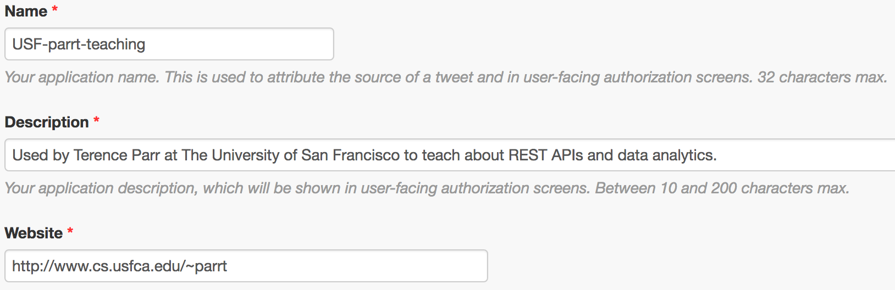

# Twitter sentiment analysis

*All projects in this class are individual projects, not group projects.  You may not look at or discuss code with others until after you have submitted your own individual effort.*

The goal of this project is to learn how to pull twitter data, using the [tweepy](http://www.tweepy.org/) wrapper around the twitter API, and how to perform simple sentiment analysis using the [vaderSentiment](https://github.com/cjhutto/vaderSentiment) library.  The tweepy library hides all of the complexity necessary to handshake with Twitter's server for a secure connection.

As you did in the recommendation engine project, you will also produce a web server running at AWS to display the most recent 100 tweets from a given user and the list of users followed by a given user. For example, in response to URL `/the_antlr_guy` (`http://localhost/the_antlr_guy` when tested on your laptop), your web server should respond with a tweet list color-coded by sentiment, using a red to green gradient:


As another example URL `/realdonaldtrump` yields:


Next you will create a page responding to URLs, such as `/following/the_antlr_guy`, that displays up to 100 users followed by a given user:


Or:


Note that the users should be sorted in reverse order by their number of followers. Just to be clear, `/following/the_antlr_guy` shows the list of users that I follow sorted by how many followers those users have. Clearly, Guido has the most followers and so he is shown first in my list of people I follow. 

The one issue is that some users have huge following lists. For our unit tests, they don't but in general they could. Select the first 100 friend IDs returned by the API and *then* get the user info for just those IDs to avoid chasing an endless list of users. Reverse sort those by number of followers.

You will do your work in repository `sentiment-`*userid*.

## Discussion

Using the twitter API, you will pull tweets and user information and then displayed using HTML.

### Authenticating with the twitter API server

Twitter requires that you register as a user and then also create an "app" for which Twitter will give you authentication credentials. These credentials are needed for making requests to the API server. Start by logging in to [twitter app management](https://apps.twitter.com/) then click on "create new app". It should show you a dialog box such as the following, but of course you would fill in your own details:



For the website, you can link to your LinkedIn account or something or even your github account. Leave the "callback URL" blank.

Once you have created that app, go to that app page. Click on the  "Keys and Access Tokens" tabs, which shows 4 key pieces that represent your authentication information:

* Consumer Key (API Key)
* Consumer Secret (API Secret)
* Access Token
* Access Token Secret	

Under the Permissions tab, make sure that you have your access as "Read only" for this application. This prevents a bug in your software from doing something horrible to your twitter account!

**We never encode secrets in source code**, consequently, we need to pass that information into our web server every time we launch. To prevent having to type that every time, we will store those keys and secrets in a CSV file format:

*consumer_key*, *consumer_secret*, *access_token*, *access_token_secret*

The server then takes a commandline argument indicating the file name of this data. For example, I pass in my secrets via

```bash
$ gunicorn -D --threads 4 -b 0.0.0.0:5000 --access-logfile server.log server:app ~/Dropbox/licenses/twitter.csv
```

Please keep in mind the [limits imposed by the twitter API](https://dev.twitter.com/rest/public/rate-limits). For example, you can only do 15 follower list fetches per 15 minute window, but you can do 900 user timeline fetches.

### Mining for tweets

In file `tweetie.py` (pronounced "tweety pie", get it?) you will create methods to fetch a list of tweets for a given user and a list of users followed by a given user.  Function `fetch_tweets()` returns a dictionary containing:

* `user`: user's screen name
* `count`: number of tweets
* `tweets`: list of tweets

where each tweet is a dictionary containing:

* `id`: tweet ID
* `created`: tweet creation date
* `retweeted`: number of retweets
* `text`: text of the tweet
* `hashtags`: list of hashtags mentioned in the tweet
* `urls`: list of URLs mentioned in the tweet
* `mentions`: list of screen names mentioned in the tweet
* `score`: the "compound" polarity score from vader's `polarity_scores()`

Function `fetch_following()` returns a dictionary containing:

* `name`: user's real name
* `screen_name`: Twitter screen name (e.g., `the_antlr_guy`)
* `followers`: number of followers
* `created`: created date (no time info)
* `image`: the URL of the profile's image
       
This information is needed to generate the HTML for the two different kinds of pages.
 
### Generating HTML pages

In the starter kit, I provide sample HTML files, [sample-parrt-tweets.html](https://github.com/parrt/msds692/blob/master/hw/code/sentiment/sample-parrt-tweets.html) and [sample-parrt-following.html](https://github.com/parrt/msds692/blob/master/hw/code/sentiment/sample-parrt-following.html).

We use the template engine [jinja2](http://jinja.pocoo.org/docs/2.9/) that is built-in with flask. When you call `render_template()` from within a flask route method, it looks in the `templates` subdirectory for the file indicated in that function call. You need to pass in appropriate arguments to the two different page templates so the pages fill with data.
 
Here is what a single tweet's HTML looks like:

```html
<li style="list-style:square; font-size:70%; font-family:Verdana, sans-serif; color:#ea4c00">
    -0.68: <a style="color:#ea4c00" href="https://twitter.com/the_antlr_guy/status/897491721944158208">RT @kotlin: Kotlin 1.1.4 is out! Auto-generating Parcelable impls, JS dead code elimination, package-default nullability &amp;amp; more: https://t.…</a>
</li>
```

You must update the `templates/tweets.html` HTML template to generate tweets like that. See the `add_color()` method in `server.py` for information on generating the color (`#ea4c00` in this example).

**Get max 100 tweets**.

Similarly, here is what a single followed user entry looks like on the other page:

```html
<tr>
    <td align=center width="80"></td>
    <td style="font-size:70%; font-family:Verdana, sans-serif">
        <a href="https://twitter.com/gvanrossum">Guido van Rossum</a><br>
        98538 followers<br>
        Since 2008-08-11
    </td>
</tr>
```

You must update the `templates/following.html` HTML template to generate user records like that.

**Sort the users by how many followers they have**.

## Getting started

Download the [starterkit](https://github.com/parrt/msds692/tree/master/hw/code/sentiment), which has the following files and structure (from `tree` commandline tool):

```
$ tree
├── IP.txt
├── parrt-following.html
├── parrt-tweets.html
├── server.py
├── templates
│   ├── following.html
│   └── tweets.html
└── tweetie.py
```

Next, make sure that the following Python packages are installed: `flask`, `jinja2`, `tweepy`, `vaderSentiment`, `colour`.

Examine `server.py` and `tweetie.py` carefully as it describes the functions you need to implement.

## Launching your server at Amazon

As part of your submission, you must launch a Linux instance at Amazon and install your software. Then launch your server and keep it running for the duration of our grading period. We will notify you when it's okay to terminate that instance.

Creating a server that has all the appropriate software can be tricky so I have recorded a sequence that works for me.

The first thing is to launch a server with different software than the simple Amazon linux we have been using in class. We need one that has, for example, `numpy` and friends so let's use an *image* (snapshot of a disk with a bunch of stuff installed) that already has machine learning software installed. As of August 2019, the following sequence works. Select a t2.medium instance with "*Deep Learning AMI (Ubuntu) Version 24.0 - ami-004852354728c0e51*".  Create a `t2.medium` size computer (in Oregon; it's cheaper)!  The cost is 0.047 dollars per Hour, which is only 1.12 dollars per day.

ere's how I login:
 
```bash
$ ssh -i "parrt.pem" ubuntu@somemachineIPorname
```

Then install software we need:

```bash
source activate pytorch_p36
pip install --upgrade pip
pip install flask tweepy vaderSentiment colour
conda install gunicorn # regular pip install won't work it seems
```

Now, clone your repository into the home directory:

```bash
cd ~
git clone https://github.com/USF-MSDS692/sentiment-parrt.git
cd sentiment-parrt
```

You should now be able to run your server:

```bash
$ gunicorn -D --threads 4 -b 0.0.0.0:5000 --access-logfile server.log server:app twitter.csv
```

(Test without `-D` during development so that you can see errors generated by the server; otherwise they appear to be hidden.)

`twitter.csv` is the file with your credentials.

All output goes into `server.log`, even after you log out. The `-D` means put the server in daemon mode, which runs the background.

Don't forget to open up port 5000 in the firewall for the server so that the outside world can access it. Make sure that you test from your laptop!

Make sure the `IP.txt` file as the **public** IP address of your server with `:5000` on the line by itself, such as `54.198.43.135:5000`!

## Deliverables

### Github

In your github repository, you should submit the following:

* `IP.txt`; this is a single line text file terminated by a newline character that indicates the machine name or IP address (plus `:5000`) of your server at Amazon; for your dev work only, this will be `localhost:5000`.
* `server.py`; implement `tweets()`, `add_color()`, and `following()`
* `tweetie.py`; implement `authenticate()`, `fetch_tweets()`, `fetch_following()`
* `templates/tweets.html`; use template language to generate the right HTML for the list of tweets for the screen name in the URL.
* `templates/following.html`; use template language to generate the right HTML for the users followed by the screen name in the URL.

## Evaluation

To evaluate your projects, the grader and I will go to your AWS server and test the current output for the two pages using Twitter users `the_antlr_guy` and `realdonaldtrump`. We will also launch your server locally to make sure that the software runs correctly and that its output matches what we see at your Amazon server.

**Without the IP.txt file at the root of your repository, we cannot test your server and you get a zero!**

Here is an automated bash script, I've put in `pulltwitter.sh`, that we will use to pull down the HTML from your servers (whatever server is specified in `IP.txt`):

```bash
curl "http://"$(cat IP.txt)"/the_antlr_guy" > parrt-tweets.html
curl "http://"$(cat IP.txt)"/following/the_antlr_guy" > parrt-following.html
curl "http://"$(cat IP.txt)"/realdonaldtrump" > trump-tweets.html
curl "http://"$(cat IP.txt)"/following/realdonaldtrump" > trump-following.html
```

We will run this script in all of your directories and then open up a browser on those files.

As we will be looking at it as humans not comparing it to known strings of HTML, small variations in display format are acceptable.

*You get 50% for getting the tweet list properly displayed with color gradient and 50% for getting the list of followed users correct.* As you have the complete test, you should be able to get it working and we will grade in binary fashion (works or it doesn't).
