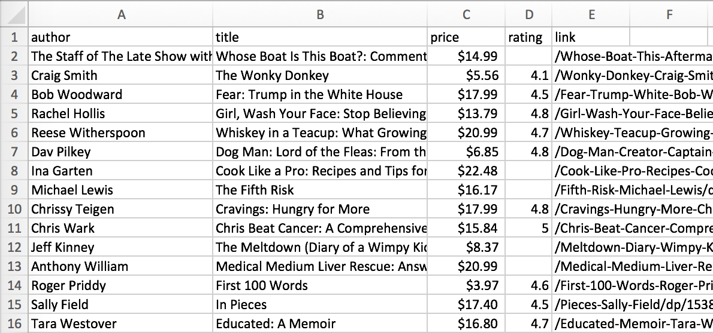

# Capturing the bestseller list from Amazon

Let's capture the [bestseller list from Amazon](https://www.amazon.com/gp/bestsellers/books/ref=sv_b_2). The HTML coming out is extremely complicated and contains lots of JavaScript, but the HTML is very organized using `span` tags. Using Chrome, I can also inspect elements. Notice that `span` tag with `class="aok-inline-block zg-item"` nicely groups each element in the bestseller list:


To collect information about each book, we just have to look at the child nodes of that `span`.

**Exercise**:  Create a function that returns a list of tuples, one per book. The tuple should contain `(price, title, author, href)`. I have given you the algorithm in pseudocode here:

```python
def parseAmazonBestSellers():
    fetch "https://www.amazon.com/gp/bestsellers/books"
    with params={'User-Agent': "Resistance is futile"})
    soup = BeautifulSoup(htmltext, 'lxml') # 'html.parser' doesn't work here!
    books = []
    for item in soup.find_all('span', {'class':"aok-inline-block zg-item"}):
	    # Link
	    link = item.a
	
	    # Image
	    img = ...
	
	    # Author
	    'Author like this: <span class ="a-size-small a-color-base" >Craig Smith</span>'
	    'OR <a class="a-size-small a-link-child" ...>Bob Woodward</a>'
	    authtag = item.find(class that is "a-size-small a-color-base")
	    if not authtag:
	        authtag = item.find(class that is "a-size-small a-link-child")
	    if authtag:
	        auth = text of authtag
	    else:
	        auth = "unknown"
	
	    # Price
	    pricetag = item.find(class that is "a-size-base a-color-price")
	    price = text of pricetag
	
	    # Rating
	    ratingtag = item.find(class that is "a-icon-alt")
	    rating = None
	    if ratingtag:
	        rating = text of ratingtag # e.g., 4.7 out of 5 stars
	        rating = extract rating
	
	    # Pack together as tuple
	    info = (auth, img alt attribute, price, rating, link href)
	    books.append(info)
    return books
```

Notice that I have included the user agent, otherwise I noticed that Amazon gave me a permission error. (It's funny that it is so easy to defeat.)  Output from:

```python
books = parseAmazonBestSellers()
for price, title, author, href in books:
    print title, author, price
    print href
    print
```

looks like:

```
Born to Run by Bruce Springsteen $19.50
https://www.amazon.com/Born-Run-Bruce-Springsteen/dp/1501141511/ref=zg_bs_books_1/158-6476629-1853566

The Girl on the Train by Paula Hawkins $9.60
https://www.amazon.com/Girl-Train-Paula-Hawkins/dp/1594634025/ref=zg_bs_books_2/158-6476629-1853566

Cooking for Jeffrey: A Barefoot Conte... by Ina Garten $21.00
https://www.amazon.com/Cooking-Jeffrey-Barefoot-Contessa-Cookbook/dp/030746489X/ref=zg_bs_books_3/158-6476629-1853566
...
```

**Exercise**:Alter your code so that it generates a CSV file suitable for Excel called `/tmp/bestsellers.csv`. Write out a header row and then iterate through your records in `books` list to create the comma separated columns. If you open that file it should look something like:


