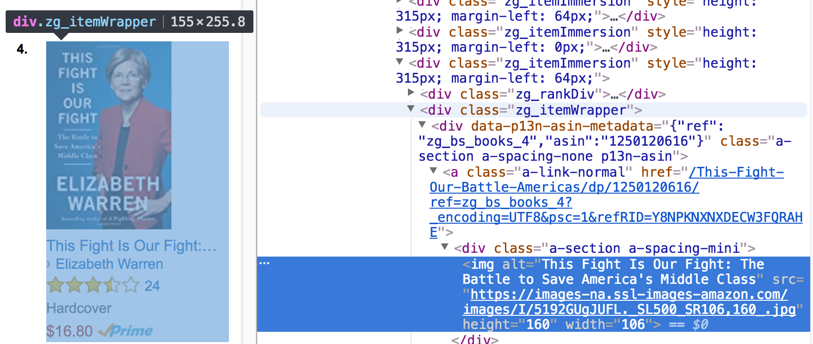

# Capturing the bestseller list from Amazon

Let's capture the [bestseller list from Amazon](https://www.amazon.com/gp/bestsellers/books/ref=sv_b_2). The HTML coming out is extremely complicated and contains lots of JavaScript, but the HTML is very organized using `div` tags. Using Firefox, I can also inspect elements. Notice that `div` tag with `class=zg_itemWrapper` nicely groups each element in the bestseller list:



To collect information about each book, we just have to look at the child nodes of that `div`.

**Exercise**:  Create a function that returns a list of tuples, one per book. The couple should contain `(price, title, author, href)`.

```python
def parseAmazonBestSellers():
    response = requests.get("https://www.amazon.com/gp/bestsellers/books/ref=sv_b_2",
                          params={'User-Agent': "Resistance is futile"})
    html = BeautifulSoup(response.text, "html.parser")
    ...
```

Notice that I have included the user agent, otherwise I noticed that Amazon gave me a permission error. (It's funny that it is so easy to defeat.)  Output from:

```python
books = parseAmazonBestSellers()
for price, title, author, href in books:
    print title, author, price
    print href
    print
```

looks like:

```
Born to Run by Bruce Springsteen $19.50
https://www.amazon.com/Born-Run-Bruce-Springsteen/dp/1501141511/ref=zg_bs_books_1/158-6476629-1853566

The Girl on the Train by Paula Hawkins $9.60
https://www.amazon.com/Girl-Train-Paula-Hawkins/dp/1594634025/ref=zg_bs_books_2/158-6476629-1853566

Cooking for Jeffrey: A Barefoot Conte... by Ina Garten $21.00
https://www.amazon.com/Cooking-Jeffrey-Barefoot-Contessa-Cookbook/dp/030746489X/ref=zg_bs_books_3/158-6476629-1853566
...
```

