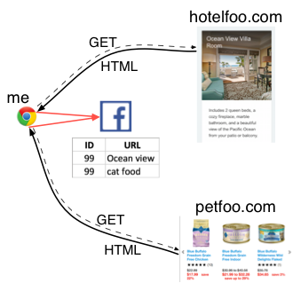

Cookies
====

*todo: use [browser cookies from python](https://bitbucket.org/richardpenman/browsercookie)*

HTTP is stateless and anonymous with a very simple request-response model.  In order to build websites like Amazon or any other website that lets you login, we need a mechanism for identifying users that come back to the same server. By identifying, we mean recognizing the same "client," not actually knowing who they are.

HTTP is pretty simple but ~20 years ago, we came up with a good idea to support stateful communications between client and server. The idea is to piggyback key-value pairs called *cookies* as regular old headers already allowed within the HTTP protocol. These key-value pairs therefore do not affect the data payload (stuff after the headers).

The cookie mechanism relies on a simple agreement between client and server. The sequence goes like this when a client visits a server for the first time:

1. Server sends back one or more cookies to the browser via headers
2. Browser saves this information and then sends the same data back to the server for every future request associated with that domain/server

A *cookie* is a named piece of data (string) associated with a specific website/URL that is saved by the browser and is sent back to that same server with every page request. The server can use that as a key to retrieve data associated with that user.

Your browser keeps a dictionary of cookies for each server.  If you have 3 browsers, each would keep a separate dictionary. That's why logging in to Amazon with Chrome doesn't log you in when looking at the server in Firefox.

If you erase your browser cookies for that domain, the server will no longer recognize you. Naturally, the server will try to send you cookies again. It is up to the browser to follow the agreement to keep sending cookies and to save data.

Can I, as a server, ask for another server's cookies (such as amazon.com's)? No! Security breach! If another server can get my amazon cookies, the other server/person can log in as me on amazon. Heck, my cookies might even store credit card numbers (bad idea). It is up to the browser to enforce this policy. Naturally, it could send every cookie or even every document on your computer via headers to a server! In essence, we are trusting browser implementors.

A server can specify the lifetime of cookies in terms of seconds to live or that cookie should die when the browser closes. It can also tell the browser to delete a cookie immediately as part of the current request.

# Sample HTTP traffic with cookies

My first request to `http://www.cnn.com/` results in a cookie coming back from cnn:

BROWSER SENDS:

```
GET / HTTP/1.1
Host: www.cnn.com
User-Agent: curl/7.49.0
Accept: */*

```

(including blank line at the end)

HEADERS FROM REMOTE SERVER (sets cookies called `countryCode`, `geoData`, `tryThing00`, ...):

```
$ curl --head https://www.cnn.com
HTTP/1.1 200 OK
Content-Type: text/html; charset=utf-8
x-servedByHost: ::ffff:172.17.79.32
access-control-allow-origin: *
cache-control: max-age=60
content-security-policy: default-src 'self' blob: https://*.cnn.com:* http://*.cnn.com:* *.cnn.io:* *.cnn.net:* *.turner.com:* *.turner.io:* *.ugdturner.com:* courageousstudio.com *.vgtf.net:*; script-src 'unsafe-eval' 'unsafe-inline' 'self' *; style-src 'unsafe-inline' 'self' blob: *; child-src 'self' blob: *; frame-src 'self' *; object-src 'self' *; img-src 'self' data: blob: *; media-src 'self' data: blob: *; font-src 'self' data: *; connect-src 'self' *; frame-ancestors 'self' https://*.cnn.com:* http://*.cnn.com https://*.cnn.io:* http://*.cnn.io:* *.turner.com:* courageousstudio.com;
x-content-type-options: nosniff
x-xss-protection: 1; mode=block
Via: 1.1 varnish
Content-Length: 1575014
Accept-Ranges: bytes
Date: Sun, 23 Sep 2018 20:23:57 GMT
Via: 1.1 varnish
Age: 162
Connection: keep-alive
Set-Cookie: countryCode=US; Domain=.cnn.com; Path=/
Set-Cookie: geoData=atlanta|GA|30303|US|NA; Domain=.cnn.com; Path=/
Set-Cookie: tryThing00=0838; Domain=.cnn.com; Path=/; Expires=Mon Jul 01 2019 00:00:00 GMT
Set-Cookie: tryThing01=1348; Domain=.cnn.com; Path=/; Expires=Fri Mar 01 2019 00:00:00 GMT
Set-Cookie: tryThing02=6478; Domain=.cnn.com; Path=/; Expires=Wed Jan 01 2020 00:00:00 GMT
X-Served-By: cache-iad2145-IAD, cache-pao17434-PAO
X-Cache: HIT, HIT
X-Cache-Hits: 1, 4
X-Timer: S1537734238.736480,VS0,VE0
Vary: Accept-Encoding

```

In a second HTTP request to the same server, we see that my browser is sending the cookie back to cnn.

BROWSER SENDS (sends cookie back to the server):

```
GET / HTTP/1.1
Host: www.cnn.com
User-Agent: curl/7.49.0
Accept: */*
Cookie: countryCode=US; geoData=atlanta|GA|30303|US|NA; tryThing00=0838; tryThing01=1348; tryThing02=6478;

```

which sends those cookie key-value pairs back to cnn. 

**Exercise:**  Open a fresh tab in your browser and open the developer tools (command-option-I on Mac). Then enter CNN.com in the URL text field to visit CNN. In chrome, you should see a bunch of network traffic to other sites:


and cookies if you select the "Application" tab you can open the "Cookies":


## Using CURL to examine cookies/headers

The `curl` program is very useful for examining the traffic between a browser and web server. The `-v` option tells it to dump the protocol elements going towards the web server (stuff after `>`) and the elements coming back from the server (stuff after `<`). For example, here is a sample session contacting the New York Times Web server:

```bash
$ curl -v www.nytimes.com
* Rebuilt URL to: www.nytimes.com/
*   Trying 151.101.41.164...
* Connected to www.nytimes.com (151.101.41.164) port 80 (#0)
> GET / HTTP/1.1
> Host: www.nytimes.com
> User-Agent: curl/7.49.0
> Accept: */*
> 
< HTTP/1.1 301 Moved Permanently
< Server: Varnish
< Retry-After: 0
< Content-Length: 0
< Location: https://www.nytimes.com/
< Accept-Ranges: bytes
< Date: Sat, 22 Apr 2017 16:24:21 GMT
< X-Frame-Options: DENY
< Set-Cookie: nyt-a=a611ba358d77595991882a6d595ab359cedd8952713792e6172e900c7a5779c7; Expires=Sun, 22 Apr 2018 16:24:21 GMT; Path=/; Domain=.nytimes.com
< Connection: close
< X-API-Version: F-0
< X-PageType: homepage
< X-Served-By: cache-sjc3633-SJC
< X-Cache: HIT
< X-Cache-Hits: 0
< X-Timer: S1492878262.875681,VS0,VE0
```

(The redirect is because everybody is moving to https now.)

CURL is not your browser and so it doesn't know what your cookies are; it just sends the most basic headers (`User-Agent` and `Accept`). In response, the Web server sends back a response code `301` and a bunch of headers, including cookie `nyt-a` with value `a611ba358d77595991882a6d595ab359cedd8952713792e6172e900c7a5779c7`. (This is different than the nytimes.com cookie shown previously in these notes probably because the cookie mechanism has changed since I wrote those  earlier notes.)

We can also use CURL to send headers, including cookies, back to the server as if it were a browser.

```bash
$ curl --cookie nyt-a=a611ba358d77595991882a6d595ab359cedd8952713792e6172e900c7a5779c7 -v www.nytimes.com
* Rebuilt URL to: www.nytimes.com/
*   Trying 151.101.41.164...
* Connected to www.nytimes.com (151.101.41.164) port 80 (#0)
> GET / HTTP/1.1
> Host: www.nytimes.com
> User-Agent: curl/7.49.0
> Accept: */*
> Cookie: nyt-a=a611ba358d77595991882a6d595ab359cedd8952713792e6172e900c7a5779c7
> 
< HTTP/1.1 301 Moved Permanently
< Server: Varnish
< Retry-After: 0
< Content-Length: 0
< Location: https://www.nytimes.com/
< Accept-Ranges: bytes
< Date: Sat, 22 Apr 2017 16:31:29 GMT
< X-Frame-Options: DENY
< Set-Cookie: nyt-a=4ac2a689a7bf5bb72fbcd4841fe00aea4d150952b2bec8f2f8fefbffe4a780f9; Expires=Sun, 22 Apr 2018 16:31:29 GMT; Path=/; Domain=.nytimes.com
...
```

Notice how `curl` has sent a cookie with the request, `> Cookie: a=a611...`.  Also note that it is different than the cookie response, `< Set-Cookie: nyt-a=4ac2...`.  No doubt the cookie encodes all sorts of information that the New York Times wants to track for each user.

If you'd like to save all cookies coming back from a server, you can use curl with `-c` to store cookies in a "cookie jar" file and `-b` to send those cookies back:

```bash
$ curl --head -c /tmp/cookies https://www.cnn.com/
HTTP/1.1 200 OK
...
Set-Cookie: countryCode=US; Domain=.cnn.com; Path=/
Set-Cookie: geoData=san jose|CA|95131|US|NA; Domain=.cnn.com; Path=/
Set-Cookie: tryThing00=2845; Domain=.cnn.com; Path=/; Expires=Mon Jul 01 2019 00:00:00 GMT
Set-Cookie: tryThing01=9444; Domain=.cnn.com; Path=/; Expires=Fri Mar 01 2019 00:00:00 GMT
Set-Cookie: tryThing02=9458; Domain=.cnn.com; Path=/; Expires=Wed Jan 01 2020 00:00:00 GMT
...
```

```bash
$ cat /tmp/cookies 
# Netscape HTTP Cookie File
# https://curl.haxx.se/docs/http-cookies.html
# This file was generated by libcurl! Edit at your own risk.

.cnn.com	TRUE	/	FALSE	0	countryCode	US
.cnn.com	TRUE	/	FALSE	0	geoData	san jose|CA|95131|US|NA
.cnn.com	TRUE	/	FALSE	1561939200	tryThing00	2845
.cnn.com	TRUE	/	FALSE	1551398400	tryThing01	9444
.cnn.com	TRUE	/	FALSE	1577836800	tryThing02	9458
```

```bash
$ curl --head -b /tmp/cookies https://www.cnn.com/
HTTP/1.1 200 OK
...
Set-Cookie: countryCode=US; Domain=.cnn.com; Path=/
Set-Cookie: geoData=san jose|CA|95131|US|NA; Domain=.cnn.com; Path=/
...
```

# How ad companies track you

## Background

We've already seen an example webpage that refers to an image from my antlr site:


The HTML asks the browser to display a simple image:


Recall that your browser makes **two** web requests, one to xyz.com to get the HTML page and **another** to www.antlr.org for the image.  

Using the inspector in Google Chrome on [pageimg.html](pageimg.html), we can see that this page fetches the icon:


It not only notifies the `antlr.org` server but the image reference gives `antlr.org` the opportunity to send cookies to the browser, say, *X=Y*. Any page, literally anywhere on the Internet, that references *anything* at `antlr.org` will send that *X=Y* cookie back to the `antlr.org` server along with the image request. Now `antlr.org` knows whenever you access a webpage containing one of its images. It can use the *Y* value to uniquely identify users simply by creating a unique identifier as *Y* for every new `antlr.org` request (any request that does not come in with antlr cookies set).

## Using hidden images to track users

Ad companies embed images in websites and therefore can send you a cookie that your browser dutifully stores. For example, here is the cookie traffic for realmedia.com that I got when I *opened an email* from `opentable.com`:

BROWSER (I clicked on an opentable email in Mail.app):

```
GET http://oascnx18015.247realmedia.com/RealMedia/ads/adstream_nx.ads/www.opentable.opt/email-reminder/m-4/4234234@x26 HTTP/1.1
...
```

REMOTE SERVER HEADERS (realmedia server sent to my browser):

```
set-cookie=NSC_d18efmoy_qppm_iuuq=9e4a423660;path=/;httponly
cache-control=no-cache,no-store,private
pragma=no-cache
...
```

There are a number of things to notice here:

1. The ad company, `realmedia.com`, tracks where the ad is using the URL parameter: `www.opentable.opt/email-reminder/m-4/4234234@x26`. In other words, it knows that I opened the email from opentable. Yikes!
2. The headers turn off caching so that every time you refresh the page it gets notified.

Now, imagine that I go to a random website X that happens to have an ad from `realmedia.com`. My browser will send all cookies associated with `realmedia.com` to their server, effectively notifying them that I am looking at X. `realmedia.com` will know about every page I visit that contains their ads *anywhere on the Internet*. And it sounds like you will know my email as well!

Recently I was looking at hotels in San Diego and also purchasing some cat food on a different website. Then I went to Facebook and saw ads for the exact rooms and cat food I was just looking at! This all works through the magic of cookies.

The easiest mechanism to make this work is as follows. The HTML pages coming back from `hotelfoo.com` and `petfoo.com` have hidden `img` tags (or maybe JavaScript but let's assume an image) that refer to URLs on some third-party ad company's server. For example, something akin to ``.  Because of the reference to `ads.com` in the hotel site HTML, our browser contacts the `ads.com` server to display the page. That `ads.com` server can send back and store cookies on my laptop that identify me as, for example ID=99. They don't know who I am but they know that they have assigned a unique identifier to my specific browser. Every time my browser sees a reference to `ads.com` in some web page, it will send back the ads.com ID=99 cookie to `ads.com`. Notice that there is a `page` parameter on the image reference that identifies the page containing the image. In other words, the ad company knows that ID 99 visited page `hotelfoo.com/oceanview`.

Now imagine I go to the pet food company that also has a hidden image reference to `ads.com`, such as ``. My browser will send ID=99 to the ad company and let it know that I have also visited page `petfoo.com/catfood`.  Here is a visualization of me visiting two different non-FB websites.



The next time I visit facebook.com I receive an HTML page but also a ref to `ads.com`. Then, the FB server quickly asks `ads.com` to send it an advertisement from one of the `ads.com` clients, in this case `hotelfoo` and `petfoo`. Those customers bid in an auction to show me an ad on Facebook. The ad company tells the hotel or pet food company which pages I have visited, which lets them decide whether to sell me an ad and also what ad to show. This all happens very quickly and in essence is just another image reference on the Facebook page.

This technology is scary but not all bad. Obviously, Google analytics requires a tiny little image or JavaScript to be embedded in your webpages so that it can track things and give you statistics.

# Accessing cookies in Python

Ok, now that we know how cookies piggyback on HTTP data packages and how they can be used for good and evil, let's work on some simple Python code that knows how to login and logout a user.

First some background. 

## Set cookies

[Flask cookie tutorial](http://www.tutorialspoint.com/flask/flask_cookies.htm) (haha. when I went to that tutorial just now after visiting petco.com to get cat food images for the above Facebook.com example, I see a cat food ad at the bottom of the tutorial from petco.com.)

**Exercise**: Make a server with one "route":

```python
@app.route('/setcookie')
def cookie_insertion():
    response = app.make_response("i set some cookies. haha!\n")
    response.set_cookie('ID',value='212392932')
    return response
```

Then look at the cookies and data coming back:

```bash
$ curl --head http://localhost:5000/setcookie
HTTP/1.0 200 OK
Content-Type: text/html; charset=utf-8
Content-Length: 26
Set-Cookie: ID=212392932; Path=/
Server: Werkzeug/0.14.1 Python/3.6.5
Date: Sun, 23 Sep 2018 21:03:31 GMT

```

Try doing the same thing in the browser using the developer tools to see the cookies:


## Fetch cookies

Once a server has sent cookies to a browser, the browser will send those cookies back to the server upon each request. In order to get those cookies, the flask "view" function can simply pull them out from the dictionary sent to the server by the browser. Very handy. 

```python
from flask import request
...
@app.route('/getcookie')
def getcookie():
   name = request.cookies.get('ID')
   return '<h1>Welcome ID '+name+'</h1>'
```

Please make the distinction in your head between GET URL parameters and cookies. GET parameters come in to the server as `?x=y` on the URL itself whereas cookies come in as part of the GET headers, not the URL.

**Exercise**: Upgrade the server from the previous section, that sets cookies, to include `getcookie()` to fetch the cookie. Now open pages in the browser in the following sequence to set and get cookies:

```
http://127.0.0.1:5000/setcookie
http://127.0.0.1:5000/getcookie
```

You should see `Welcome ID 212392932` in the browser. The key thing to note here is that there is no visible setting and getting of cookies in the URL or the displayed page. The displayed page magically knows the ID Because the cookies go back and forth as headers of the protocol, not the URL.

You can also try incrementing the ID upon each page fetch or something like that to see cookies being updated.

## Kill cookie

Servers need the ability to remove cookies from a browser's dictionary. To do that, we set the expiration date to "immediately":

```python
response.set_cookie(name, expires=0)
```

## Redirecting the browser

It's very common for a server to redirect the browser. The user goes to a specific page in their browser, but the server can send a response back to the browser that forces it to flip to a different page. (This is like giving a forwarding address to your mailman. Any mail gets redirected to the address you specified.)

**Exercise**: Using the following code, create a flask server that redirects URL `/` to `/homepage`:
 
```python
@app.route('/')
def root():
    return redirect('/homepage')

@app.route('/homepage')
def homepage():
    return "<h1>Home page</h1>"
```

Go to the browser at http://127.0.0.1:5000/ and you will see the server get to request, one for the initial fetch and one for the fetch after redirection because of the 302 result code:
  
```
127.0.0.1 - - [09/Sep/2016 11:52:08] "GET / HTTP/1.1" 302 -
127.0.0.1 - - [09/Sep/2016 11:52:08] "GET /homepage HTTP/1.1" 200 -
```

Your browser should show "Home page" in big letters and have URL `/homepage` in the URL text field.

## A login/logout server

**Exercise**: Ok, now you have all the pieces necessary to create a server that logs people in and out.

First, create a server that looks for a cookie to determine whether someone is logged in or out:

```python
@app.route("/")
def home():
    user = request.cookies.get('ID') # get cookie called 'ID'
    if user:
        body = "logged in"
    else:
        body = "NOT logged in"
    return """
    <html>
    <h1>Home page</h1>
    %s
    </html>
    """ % body
```

When you go to `/` in the browser, you should see a page that says you're not logged in.

Also add a URL route for a bad login as we will need this later.

```python
@app.route("/badlogin")
def badlogin():
    return """
    <html>
    <h1>Bad login</h1>
    </html>
    """
```

Now we need to handle logging in with a route for URL `/login`. To simulate a database we can use a dictionary:

```python
passwords = {"parrt":"foo", "maryk":"bar"}
```

You can add whatever users you want there.

Here's the outline of your function that you should fill in:

```python
@app.route("/login")
def login():
    # get user, password arguments
    user = ...
    password = ...
    if len(user)>0 and len(password)>0 and \
        user in passwords and password==passwords[user]:
        # create a redirect response that forces browser to flip pages to /
        response = ...
        # set cookie ID to a random number to simulate a real ID
        ID = str(random.randint(1000,200000))
        ...
    else:
        # bad password or unknown user.
        # redirect to /badlogin and do NOT set cookie
        response = ...
    return response
```

If you restart your server and turn on the developer tools then go to `http://127.0.0.1:5000/login?user=parrt&password=foo`, it should test for valid login and then redirect you to the homepage. If you look at the developer tools in chrome, you will see the following:


Now, right-click on the cookie and tell it to delete. Refresh the browser, and it should then show you're not logged in on the homepage.

Finally, we need a way to log you out more gracefully than having to manually delete cookies. Fill in and add the following function to your server.

```python
@app.route("/logout")
def logout():
    # delete 'ID' cookie and redirect to '/'
    response = ...
    response.set_cookie(...)
    return response
```

Now restart your server and go to the login page `http://127.0.0.1:5000/login?user=parrt&password=foo` again. It will set your `ID` cookie and then send you to the homepage, showing that you are logged in. Now go to the `http://127.0.0.1:5000/logout` page in the browser, which will delete the `ID` cookie and go back to the homepage automatically.

Congratulations! You now fully understand how servers can log you in and out even in a stateless protocol like HTTP.
/Firefo
