# Debugging with PyCharm

Jupyter notebooks are very handy for creating a testing machine learning models because we need to tweak and retest frequently. If loading the data takes forever then this dramatically reduces the number of iterations we can perform.  The notebook keeps the Python interpreter running in the background so we can keep executing little snippets of code, but it's easy to get lost unless we occasionally restart and rerun the entire notebook.

The negative of notebooks is that they often become junk drawers of code snippets without any overall organization and might not even run correctly from beginning to end. If you are going to be shipping code to somebody you need to send them a program that works from a completely blank slate in the interpreter all the way through the end of the program.

Further, programs that consist of lots of functions or large programs can be very difficult to develop inside a notebook. Ultimately, we need to shift that support code into a Python file that we either import or run separately.

Over the last 40 years, programmers have created extremely sophisticated development environments that help programmers do their job. They provide a rich source of information about programs, help us navigate and understand code quickly, and provide interactive debugging to step through the program.  Notebooks have access to the `pdb` debugger but it's the commandline equivalent of debugging. It's much easier to debug with the PyCharm debugger because it looks like a dashboard containing lots of useful information.

The goal of this lecture lab is to get you familiar with PyCharm and run through a few debugging scenarios. This will make debugging your projects in this class much easier. These programs are of a very different nature than the simple scripts we built in the boot camp, for example. That's why I have not asked you to create notebooks.

## Viewing data frames and series in PyCharm

(Choose PyCharm menu "View>Scientific Mode".)

From jupyter notebooks, you are use to being able to display data frames in a nice way. Let's do the same thing in PyCharm using the debugger. First, let's enter a little program in a file called `df.py` that loads `SampleSuperstoreSales.csv`:

```python
import pandas as pd

df = pd.read_csv("../../data/SampleSuperstoreSales.csv")
print(df)
N = len(df)
sales = df['Sales']
print(sales)```
If we just run this with the run button or right-click and select run, we see typical output:

```
      Row ID  Order ID     ...     Product Base Margin   Ship Date
0        1.0       3.0     ...                    0.80  2010-10-20
1       49.0     293.0     ...                    0.58  2012-10-02
...
[8399 rows x 21 columns]
0         261.5400
1       10123.0200
...
```

That's pretty ugly so let's use the debugger to ask questions about the program. First, click in the gutter to the left of the first print statement.

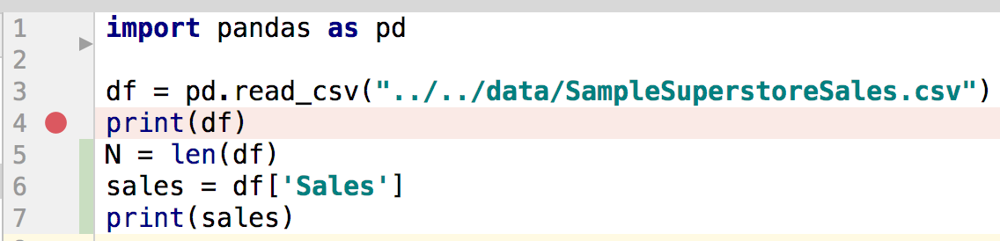

That sets a *breakpoint* and turns on a little red dot. Now, instead of hitting the run button, hit the debug button that looks like a little bug (or right click and select debug). The program will start up and run until it hits the breakpoint. The line containing the breakpoint will be solid blue indicating that is where the current line of execution is. If you look below, you will see all of the currently active variables. For example, at this point the only variable we have defined is `df`:


You can see that the debugger is trying to show you what the value is but it's two-dimensional so click on the "View as data frame" which will pop up a tab showing the data frame is a table:

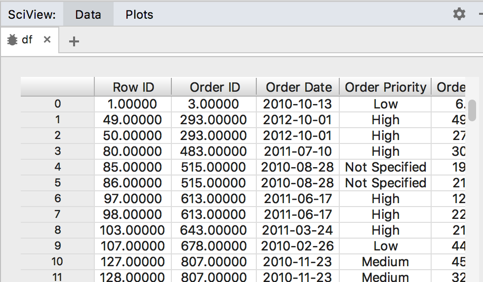

You can also click on the triangle next to variable `df` to get it to expand and show you its individual fields:


## Basics of starting and stopping execution

### Single-stepping

Let's examine the effect of executing the other statements. We want the debugger to advance one statement, which we call single stepping. Because individual statements can call functions, we also call this stepping over, because we would step over function calls such as `print()` instead of descending into them. Under the Run menu select "Step over" or hit F8. You will now see some output in the console tab:

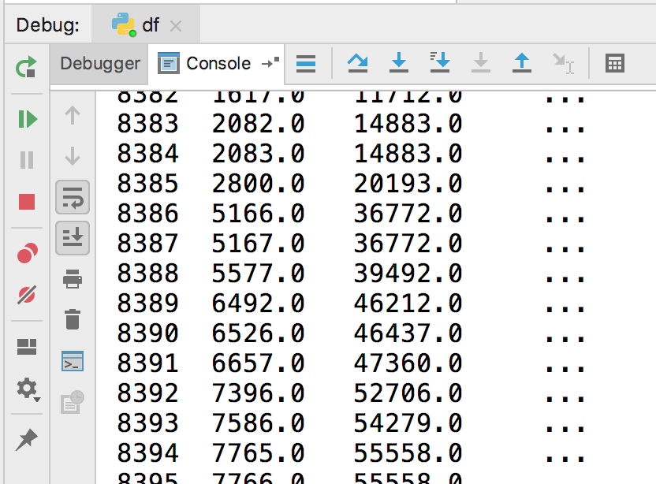

Single step again and variable `N` gets created and added to the list of variables below. Single step again and we get `sales`, which we can also see as a series:

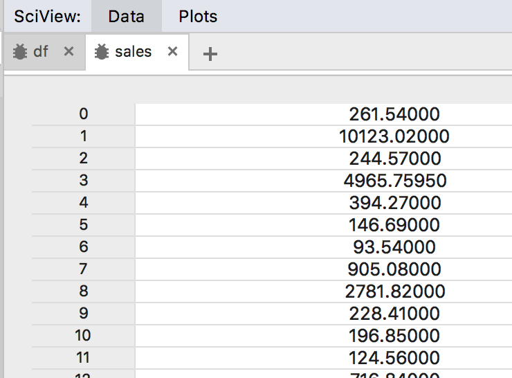

Notice that we can also go back and see the `df` tab to show that data frame. In many ways this is more convenient than notebooks.

The one thing that cannot really do easily is change your code without restarting the debugger. Unless we are running an extremely expensive program or loading some very large data, this is not usually a problem. We can also load a subset of data to work on a smaller problem so that we can iterate quickly. This is a very common programming trick in development environments like this or with notebooks.

### Jump to next break point

Try setting another breakpoint on the second print statement and hit the debug button. It should look like this when it stops at the first breakpoint:

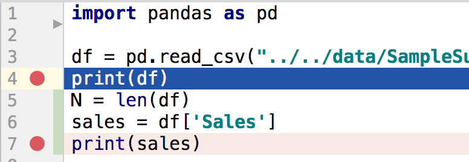

Now, select the "Run>Resume program" menu option or hit F9. The program will resume and stop at the next breakpoint, which is the second print statement. This is how you would jump through program quickly rather than having to single step.

If you want to stop program execution at any time, just hit the red square in the debug tab. Make sure you don't leave a bunch of debugging sessions running as it is a waste of memory and CPU power.

### Plots

PyCharm also knows how to collect all of the images that you create with matplotlib etc... into its scientific view area. Let's create a new program file called `dfplot.py`:

```python
import pandas as pd
import matplotlib.pyplot as plt

df = pd.read_csv("../../data/SampleSuperstoreSales.csv")
plt.scatter(df.Discount,df.Sales)
plt.show()
```

If you run that you will see the image appear to the right:

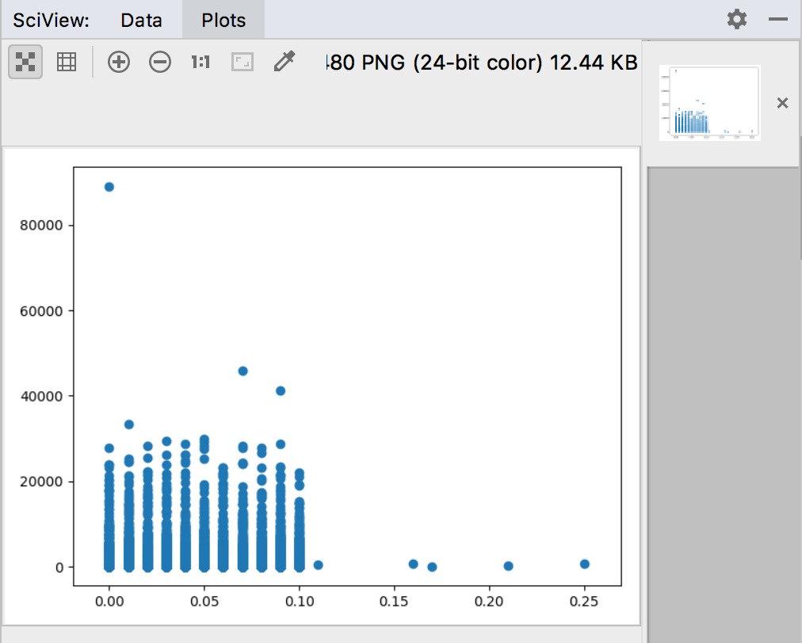

(There is also a preference you can set to have a separate window pop up.)

## Debugging a loop

Create another file called `matrix.py` in which we will add matrices `X` and `Y` to get `Z`:

```python
import numpy as np

X = np.array(
    [[1, 8, 3],
     [4, 2, 6],
     [13, 8, 1]])

Y = np.array(
    [[4, 8, 4],
     [8, 2, 4],
     [5, 1, 10]])

Z = np.zeros((3,3))
for i in range(3):
   for j in range(3):
       Z[i][i] = X[i][j] + Y[i][j]

print(f"Z={Z}")
```

If you run this, you will see output that gives the wrong matrix:
 
```
Z=[[ 7.  0.  0.]
 [ 0. 10.  0.]
 [ 0.  0. 11.]]
```

Something is wrong and so we need to run the debugger. Set a breakpoint at the `for` loop line and hit the debug button. Next, single step twice using F8 or the menu option. Your code pane should look like:

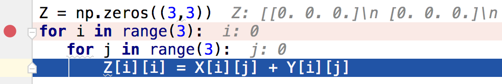

The variable pane should look like:


If you click on the "View as Array", then you will see the matrix in the scientific view area:

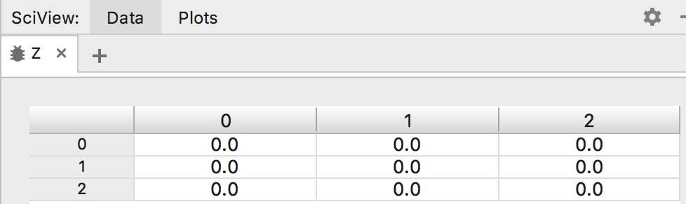

Now, keep hitting the F8 button to continue single stepping through the loop and watch the values in that matrix change, either in the variables area or in the scientific view. After one more single step, we can see that 5.0 has appeared in the `0,0` location of the matrix. 

As we keep single stepping, `i,j` becomes `0,1`. That means we should be updating that position in the `Z` matrix. Step over the `Z[i][i]` line and you see that the `0,0` position got updated not `0,1`. Oops. Now we discovered our bug. That should be `Z[i][j]`! At this point we can stop the program using the square box.

## Stepping into a function

Let's modify our program so that the matrix addition occurs within the function. Create a program file called `funcadd.py`:

```python
import numpy as np

def add(A, B):
    C = np.zeros((3,3))
    for i in range(3):
       for j in range(3):
           C[i][j] = A[i][j] + B[i][j]

    return A
    
X = np.array(
    [[1, 8, 3],
     [4, 2, 6],
     [13, 8, 1]])

Y = np.array(
    [[4, 8, 4],
     [8, 2, 4],
     [5, 1, 10]])

Z = add(X,Y)
print(f"Z={Z}")
```

If we run the program, we get the wrong answer however. We can probably figure this out by inspection, but let's use the debugger.
 
Set a breakpoint at the function call to  `add()` and hit the debug button. You should see variables `X` and `Y` available within the variables windowpane.

If you would like to do some interactive testing of variables and expressions, you can use the calculator button just above the variables windowpane to pop up a dialog box:

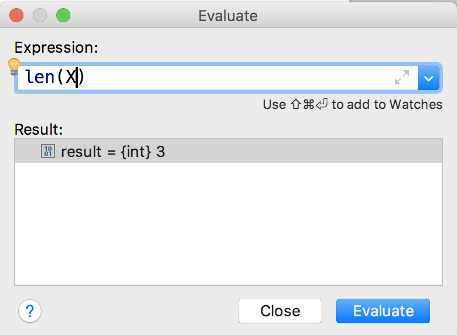

Now, lets *step into* the `add()` function using F7 or "Run>Step into" menu option.  Notice that we have a new frame pushed onto the stack of frames:

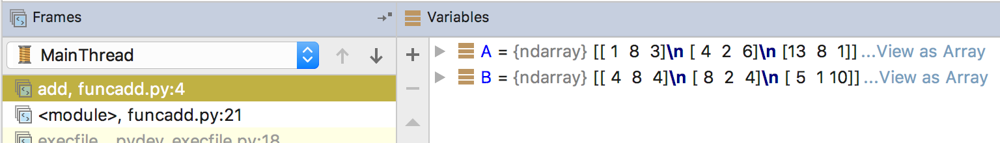

We moved from line 21 in the `funcadd.py` module to line 4 in the `add()` function.  Notice also that we have the `A` and `B` arguments to the function shown as local to `add`. If we click on the `funcadd.py` line, the debugger shifts its context to our main program, which has the same data but named differently:

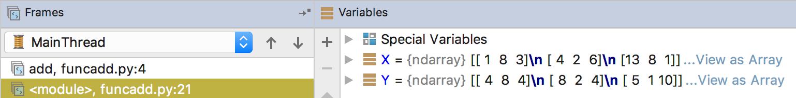

Frames are just contexts or scopes and all variables are created in the current scope. For example, if we create a variable such as `C` within function `add()`, it will be created within `add`'s frame (the current frame).

From our previous debugging, we know that the computation is correct now so it must be something in the return statement or the set up. Let's set a breakpoint on the return statement, which we can do while the program is idle in the debugger. Then hit the F9 resume program button. We can inspect the variables and see that `C` looks right:

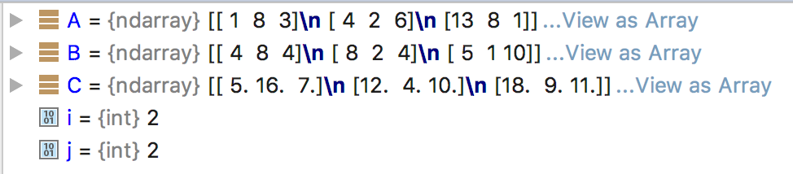

But oh shoot!  We are returning the wrong matrix!  Problem solved and we can hit the red box to stop the program.

This just scratches the surface of what you can do with the debugger and the PyCharm development environment. I encourage you to get familiar with it so that you can be more productive as a programmer. Naturally, if you're just doing some machine learning scripts, it's easier to use jupyter notebooks. But, for larger programs, you will likely need to start building Python files rather than notebooks.  PyCharm will make you much more productive than simply using a text file editor.