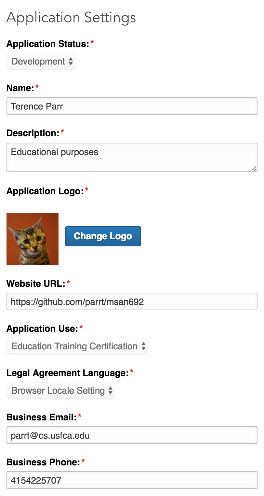

# Pulling data from LinkedIn

Register as a developer at linkin and then [create a known entity](https://www.linkedin.com/secure/developer?newapp=) (application) that will communicate with the API.  Unless you apply for the [LinkedIn partner program](https://developer.linkedin.com/partner-programs/apply), the amount of information we can get is almost 0, but we can get basic profile information.

When creating the application, I just used my name for the application name:



Under authentication, make sure that you specify the OAuth 2.0 redirect URL:
 


When our program attempts to authorize a user, we must specify a redirect URL and it must match what you have here.

## Impersonating a user

Start by reading [OAuth 2.0 for linkedin](https://developer.linkedin.com/docs/oauth2)

Here are some important quotes from the LinkedIn documentation:
 
* To request an authorization code, you must direct the user's browser to LinkedIn's OAuth 2.0 authorization endpoint.

* When the user completes the authorization process, the browser is redirected to the URL provided in the redirect_uri query parameter sent to the authorization endpoint.  This [URL] value must match one of the defined OAuth 2.0 Redirect URLs in your application configuration. [see above]
 
* Attached to the redirect_uri will be two important URL arguments that you need to read from the request: `code`, `state` (*we will ignore the state*). The code is a value that you will exchange with LinkedIn for an actual OAuth 2.0 access token in the next step of the authentication process.
 
* [Notes on the `state`] Before you accept the authorization code, your application should ensure that the value returned in the `state` parameter matches the state value from your original authorization code request. This ensures that you are dealing with the real original user and not a malicious script that has somehow slipped into the middle of your authentication flow.  If the state values do not match, you are likely the victim of a CSRF attack and you should throw an HTTP 401 error code in response.

Ok, let's get down to business and try to  communicate with LinkedIn. Start by installing this library:

```bash
$ pip install python-linkedin
```

## Get profile

As usual, we are not going to directly encode our secret app ID as part of the program:

```python
KEY = sys.argv[1]
SECRET = sys.argv[2]
```

Before asking the user to contact the authentication server, we need to create a few objects used by the LinkedIn Python library:
 
```python
RETURN_URL = "http://localhost:8000/"
authentication = linkedin.LinkedInAuthentication(KEY, SECRET, RETURN_URL,
                                                 ['r_basicprofile'])
application = linkedin.LinkedInApplication(authentication)
```

Now, direct the user's browser to the authentication URL, which has been automatically stored in the `authentication` object.

```python
webbrowser.open_new_tab(authentication.authorization_url)
```

Of course, we need a server that's going to respond to the redirection done by the browser after the user authenticates with their username and password at LinkedIn:

```python
def wait_for_user_to_login_via_browser(app):
    class MyHandler(BaseHTTPServer.BaseHTTPRequestHandler):
        def do_GET(self):
            p = self.path.split('?')
            if len(p) > 1:
                params = urlparse.parse_qs(p[1], True, True)
                app.authentication.authorization_code = params['code'][0]
                app.authentication.state = params['state'][0]
                # POSTs to https://www.linkedin.com/uas/oauth2/accessToken
                app.authentication.get_access_token() # creates and sets app.token (access token)
            self.send_response(200)
            self.end_headers()
            return

    server_address = ('localhost', 8000)
    httpd = BaseHTTPServer.HTTPServer(server_address, MyHandler)
    httpd.handle_request()
    return
```

The key thing that that server does is listen for an HTTP request and then pull out the `code` and POST it to `https://www.linkedin.com/uas/oauth2/accessToken` in order to exchange that code for an access token. The response json from that request contains the access token.  Function `get_access_token()` from the Python library does all of the work POSTing and extracting the access token:

```python
def get_access_token(self, timeout=60):
    assert self.authorization_code, 'You must first get the authorization code'
    qd = {'grant_type': 'authorization_code',
          'code': self.authorization_code,
          'redirect_uri': self.redirect_uri,
          'client_id': self.key,
          'client_secret': self.secret}
    response = requests.post(self.ACCESS_TOKEN_URL, data=qd, timeout=timeout)
    raise_for_error(response)
    response = response.json()
    self.token = AccessToken(response['access_token'], response['expires_in'])
    return self.token
```        

Function `wait_for_user_to_login_via_browser()` finishes after the server gets a single request, which of course has then retrieved our access token and saves it in the `authentication` object. Therefore we can use that to get access to profiles. Here is how I can access my profile:

```python
profile = application.get_profile(member_url='https://www.linkedin.com/in/terence-parr-33530')
print "%s %s, %s" % (profile['firstName'], profile['lastName'], profile['headline'])
```

When I run the script, I get the following output, but of course you will have to use your own credentials. If you are LinkedIn with me, you should be able to complete this request.
 
```
Terence Parr, Professor at University of San Francisco
```

For example, I am LinkedIn with [David Uminsky](https://www.linkedin.com/in/david-uminsky-5153b1a8) so I am able to run that script with his `member_url`:

```
David Uminsky, Associate Professor and Director of Analytics at University of San Francisco
```

LinkedIn won't give us really much else so let's move on to Facebook.