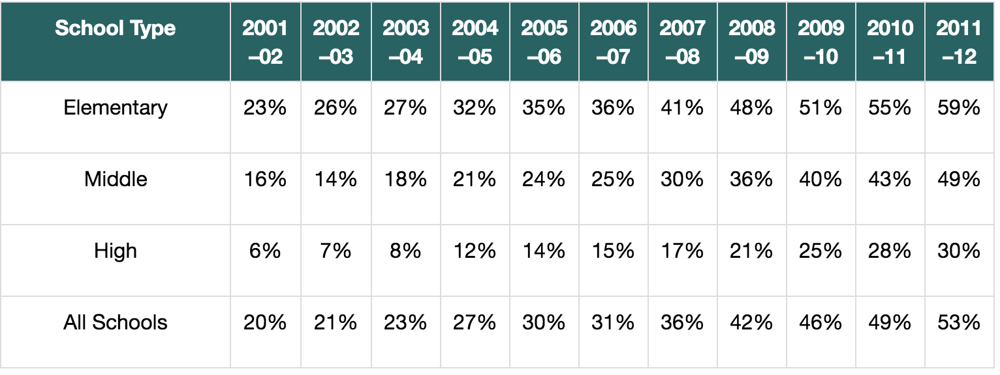
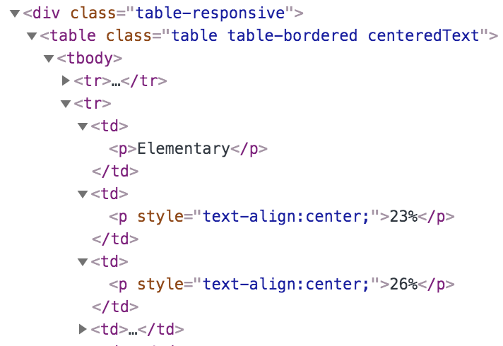

## Extracting a table of data

Let's see if we can pull academic performance data from [2011–12 Accountability Progress Reporting System:
Summary of Results](https://www.cde.ca.gov/nr/ne/yr12/yr12rel96.asp).   The tables embedded in the page look like:



and the associated HTML is not too hard to pull apart:
 


On the other hand, it's a hassle to do manually. Fortunately, Pandas as an amazingly-useful method called `pd.read_html(s)` that knows how to extract the data from an HTML table into a data frame.

**Exercise**:  Write a program to get the tables out of that page and then use pandas to extract dataframes, printing out the results. Your output should look something like

```
Table 1
   School Type 2001 –02 2002 –03 2003 –04 2004 –05 2005 –06 2006 –07 2007 –08 2008 –09 2009 –10 2010 –11 2011 –12
0   Elementary      23%      26%      27%      32%      35%      36%      41%      48%      51%      55%      59%
1       Middle      16%      14%      18%      21%      24%      25%      30%      36%      40%      43%      49%
2         High       6%       7%       8%      12%      14%      15%      17%      21%      25%      28%      30%
3  All Schools      20%      21%      23%      27%      30%      31%      36%      42%      46%      49%      53%

Table 2
                                   Type  2011 Base API  2012 Growth API  2011–12 API Point Growth
0                             Statewide            778              788                        10
1             Black or African American            696              710                        14
2      American Indian or Alaska Native            733              742                         9
...
```


