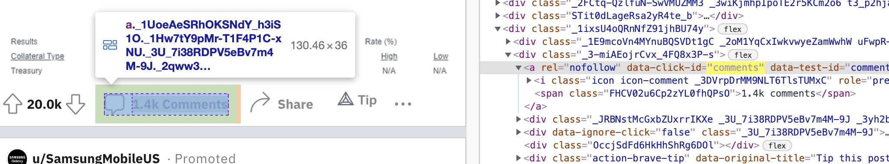

# Collecting data from web pages

We already know how to fetch a webpage using `requests.get(...)`. The question is: How do we extract useful information from the HTML. We are going to use BeautifulSoup again to parse the HTML and then search for elements of interest.

[Lots of useful web scraping info here](https://automatetheboringstuff.com/chapter11/)

## Baby steps

**Exercise**: Write Python code (`requests` lib) to grab the latest news from Hacker News in your browser, part of the Y Combinator startup incubator: `https://news.ycombinator.com/`. Parse the data with BeautifulSoup and then find all of the links to news.  You can either look at the page source in your browser to see what HTML renders those links or you can use chrome browser. Right-click over one of the links and say "inspect". It will show you the HTML associated with that link:


Notice that the link has a CSS class: `class="storylink"`. Fantastic, now that is convenient.  So you just have to figure out how to get BeautifulSoup to search for all tags that have that CSS class then print the link and link text:

```python
for link in soup.find_all(...):
    print link['href'], link.text
```

*Hint:* Search for "beautifulsoup find all class."

If you want to get fancy, you can make a list of tuples, where each tumble is a (*link*,*link text*), and then print the list.

[Solutions](https://github.com/parrt/msds692/tree/master/notes/code/scrape)

## Mimicking a "human using a browser"

Many websites would prefer that you did not scrape their data using a program, so we often have to mimic a human. There are two key elements:

1. varying the amount of time in between fetches to that server
2. specifying a header that indicates we are a browser. I use: `User-Agent: Resistance is futile`  (haha)

**Exercise**: Alter your script to use a new function called `fetch` that waits a random amount of time in between two integer number of seconds:

```python
def fetch(url,delay=(1,3)):
    """
    Simulate human random clicking 1..3 seconds then fetch URL.
    Returns the actual page source fetched and the beautiful soup object.
    """
    time.sleep(random.randint(delay[0],delay[1])) # wait random seconds
    ... fetch data from URL and parse with beautiful soup ...
    return (html,soup)
```

Of course, you have to alter your code that does the `requests.get()` to call this function now instead. This is a way to guarantee that we don't pound somebody's server and get cut off. It's also a good example of a failsafe (give example from jguru with email on/off switch at the outgoing SMTP client).

Verify that you can still get the hacker news page.

[Solutions](https://github.com/parrt/msds692/tree/master/notes/code/scrape)

Next, we need to pretend to be a browser, which means setting a header that goes out with the HTTP protocol to the remote server. For example, if you view [this URL](https://api.github.com/meta) in your browser, it's no problem but a regular `requests.get()` without a `User-Agent` will get a 403 permissions error from the server. Here is an example from the command line:

```bash
$ curl --user-agent "" https://api.github.com/meta
Request forbidden by administrative rules. Please make sure your request has a User-Agent header (http://developer.github.com/v3/#user-agent-required). Check https://developer.github.com for other possible causes.
```

**Exercise**: Alter function `fetch` so that it passes a `User-Agent` header so that the protocol going to the Web server will include:

```
User-Agent: Resistance is futile
```

or some other header value. You will pass in a dictionary with that keyvalue pair as the `headers` argument of `requests.get()`.

The default headers are the following, which you can get with `requests.utils.default_headers()`:

```
{
    'User-Agent': 'python-requests/2.26.0',
    'Accept-Encoding': 'gzip, deflate, br',
    'Accept': '*/*',
    'Connection': 'keep-alive'
}
```

For some reason, setting the user agent from Python does not prevent the requests library from fetching the data from github; not sure why, but it's good to learn how to set headers in this exercise.

## Reddit

Ok, so Hacker News might shut us down with all of us hitting their server the same time from the same network location. As a back up, you can scan [reddit news](https://www.reddit.com/r/all).  You will have to set the `User-Agent` header to something in your request or won't get any links.

See [Scraping reddit](https://www.datacamp.com/community/tutorials/scraping-reddit-python-scrapy). And the `reddit.py` script in the solutions for this lecture/lab.

Let's say we want all the "Comments" links. By inspecting a comment link on that page with the browser (using developer tools), we can find its distinguishing characteristics:

```
<a rel="nofollow" data-click-id="comments" data-test-id="comments-page-link-num-comments" class="_1UoeAeSRhOKSNdY_h3iS1O _1Hw7tY9pMr-T1F4P1C-xNU _3U_7i38RDPV5eBv7m4M-9J _2qww3J5KKzsD7e5DO0BvvU" href="/r/Superstonk/comments/p2hjao/daily_reverse_repo_update_0811_1000460b/"><i class="icon icon-comment _3DVrpDrMM9NLT6TlsTUMxC" role="presentation"></i><span class="FHCV02u6Cp2zYL0fhQPsO">1.4k comments</span></a>
...
```



After a lot of playing around, I decided to find all `a` tags and then filter for those starting with `/r/` and having `data-click-id` as `comments`.

To find all outgoing links we could just filter links for `http:` prefixes.

**Exercise**:  Pull out all of the comment links from reddit and print them.  It should look something like this:

```
href: /r/funny/comments/9k83m9/when_it_rains/
href: /r/DiWHY/comments/9k7j45/a_bowl_of_human_suffering/
href: /r/oddlysatisfying/comments/9k7o66/gorgeous_wave/
href: /r/pics/comments/9k777k/a_weeping_george_gillette_in_1940_witnessing_the/
href: /r/aww/comments/9k7evd/the_most_adorable_duck_i_have_ever_seen/
...
```

[Solutions](https://github.com/parrt/msds692/tree/master/notes/code/scrape)
