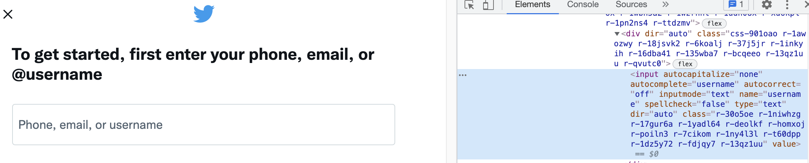
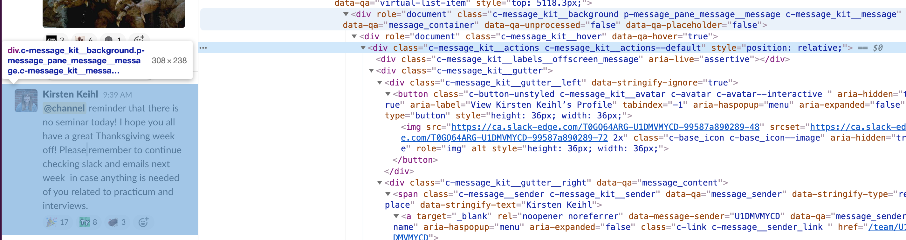

# Selenium 

We have seen how to use Python programs to scrape data from websites, but there are three scenarios that make it more challenging

1. Accessing data behind login screens
2.  Having to click through a bunch of stuff to dig into the middle of a website somewhere without a clear URL to jump to
3. Accessing data that is the result of executing JavaScript

[Selenium](http://www.seleniumhq.org/) is a tool that lets us automate actions within a browser as if we were clicking or typing as a human. This lets us login and do anything else a human can do when using the browser. Perhaps most importantly, it allows us to scrape data from webpages that generate HTML using JavaScript executing within the browser; i.e., there are some webpages that are pure JavaScript and no HTML.

## Installation

Step 1. Download/install Chrome browser.

Step 2. Install python packages we need.

```bash
pip install -U selenium
pip install chromedriver
```

Step 3. Install chrome driver binary executable (non-Python code):

```bash
brew cask install chromedriver
```

<hr>
If that `brew` doesn't work, manually download [Chrome driver binary](https://sites.google.com/a/chromium.org/chromedriver/downloads) using your browser. The pip stuff just makes the python packages but the real meat is in the binary download. Now, unzip the `chromedriver_mac64.zip` file (or whatever for your platform) and move the executable binary to the standard place:

```bash
mv ~/Downloads/chromedriver /usr/local/bin
```

(You might have to create `/usr/local/bin` dir.)
<hr>

If you get error, "*chromedriver cannot be opened because the developer cannot be verified. macOS cannot verify that this app is free from malware*" when you run `/usr/local/bin/chromedriver`, try:

```bash
xattr -d com.apple.quarantine /usr/local/bin/chromedriver
```

I also noticed that the driver was sitting in my Anaconda directory: `~/opt/anaconda3/chromedriver-Darwin` but don't use this one as it is out of date: the version numbers are different:

```bash
$ ~/opt/anaconda3/chromedriver-Darwin
Starting ChromeDriver 2.24.417412 (ac882d3ce7c0d99292439bf3405780058fcca0a6) on port 9515
Only local connections are allowed.
```

```bash
$ /usr/local/bin/chromedriver 
Starting ChromeDriver 87.0.4280.20 (c99e81631faa0b2a448e658c0dbd8311fb04ddbd-refs/branch-heads/4280@{#355}) on port 9515
Only local connections are allowed.
Please see https://chromedriver.chromium.org/security-considerations for suggestions on keeping ChromeDriver safe.
[1606765857.984][WARNING]: FromSockAddr failed on netmask
ChromeDriver was started successfully.
```

*On mac, make sure Chrome browser is installed in the usual spot:* `/Applications/Google Chrome.app/`.

## Launching a Chrome Browser

Here is the boilerplate code that launches a chrome browser to the Google search page, waits for a keypress, and then closes the browser. Call it `launch_chrome.py`.

(Do *not* call your program `selenium.py` or you won't be able to import selenium.)

```python
import time
from selenium import webdriver

driver = webdriver.Chrome('/usr/local/bin/chromedriver')  # Optional argument, if not specified will search path.
# or, fill in your ANACONDA_INSTALL_DIR and try this:
# driver = webdriver.Chrome('ANACONDA_INSTALL_DIR/chromedriver-Darwin')

driver.get('http://www.google.com')

# here is where some useful work would typically happen

input("Press Enter to quit")
driver.quit() # close browser
```

Notice that this is creating an entirely new instance of the browser (You'll see a new chrome icon appear).

**Exercise**: Make sure you can get that code working.

## Puppeteering with Chrome Browser

Let's start by asking chrome to perform a search for `USF data science`. The
[Selenium python API doc](http://selenium-python.readthedocs.io/locating-elements.html#locating-elements) shows us that we can find elements by name. Conveniently the name of the search entry box is `q`, determined by using `inspect` functionality in the chrome browser itself:


**Exercise**: Using the boilerplate code from the previous section, add the following functionality and watch the browser perform a search for you.

```python
search_box = driver.find_element_by_name('q')
search_box.send_keys('USF data science')
search_box.submit()
```

[Solutions](https://github.com/parrt/msds692/tree/master/notes/code/selenium)

## Support code for logging in

*This broke Fall 2019 with 10.14.6 OS X due to tkinter causing OS X to crash. Thanks to Srikar Murali we have a simpler solution for typing username/password from command line. Leaving this here as it's useful to know how to build a GUI in Python.*

We don't ever want to store a username and password in our source code. Also, if we hardcoded info like that, we could not use software for different users. Instead, we should read the info each time the program runs via `login.py` script:

```
from getpass import getpass

def login():
    user = input("Enter your username: ")
    password = getpass()
    return user, password

if __name__ == '__main__':
    print(login())
```

**Exercise**: Run that program and verify that it prints out a sample (meaningless) username and password.

### GUI version

I built a little dialog box in `login_gui.py` that asks for a username and password from the user. The `login()` returns when the user clicks on the `Login` button:

```python
from tkinter import *

def login():
    master = Tk()
    Label(master, text="Username").grid(row=0)
    Label(master, text="Password").grid(row=1)

    user = Entry(master)
    password = Entry(master, show="*")

    user.grid(row=0, column=1)
    password.grid(row=1, column=1)

    Button(master, text='Login', command=master.quit).grid(row=3, column=0, sticky=W, pady=4)
    master.bind('<Return>', lambda x: master.quit())

    mainloop()

    u, p = user.get(), password.get()
    master.destroy();
    return u, p

if __name__ == '__main__':
    print(login())
```
 
## Log in to twitter, pull a following list

In order to login to twitter, we can go directly to `https://twitter.com/login`, where we see `form` fields:



The input elements are:

```html
<input autocapitalize="none" autocomplete="on" autocorrect="off"
  name="session[username_or_email]" spellcheck="false"
  type="text"
  dir="auto" data-focusable="true" class="r-30o5oe
  r-1niwhzg r-17gur6a r-1yadl64 r-deolkf r-homxoj r-poiln3
  r-7cikom r-1ny4l3l r-1inuy60 r-utggzx r-vmopo1 r-1w50u8q
  r-ny71av r-1dz5y72 r-fdjqy7 r-13qz1uu" value="">
```

and

```html
<input autocapitalize="none" autocomplete="on" autocorrect="off"
 name="session[password]" spellcheck="false" 
 type="password" 
 dir="auto" data-focusable="true" class="r-30o5oe r-1niwhzg 
 r-17gur6a r-1yadl64 r-deolkf r-homxoj r-poiln3 r-7cikom 
 r-1ny4l3l r-1inuy60 r-utggzx r-vmopo1 r-1w50u8q r-ny71av
 r-1dz5y72 r-fdjqy7 r-13qz1uu" value="">
```

That is where the user should enter their username and password. We need to launch a chrome browser at that URL and then inject characters into those two fields.  I tried selecting the input fields by `name` but it didn't work so I had to look for the `input` tags and check their type using XPath:

```python
driver.find_element_by_css_selector("input[type='text']")
```

Also, I had to put in a time delay after the page fetch to allow JavaScript time to compute and populate the login page.


**Exercise**:  Write a script to login to twitter. [Solutions](https://github.com/parrt/msds692/tree/master/notes/code/selenium)


**Exercise**: Next, alter the script to view the list of users followed by our Data Institute. You can get this information starting here `https://twitter.com/DataInstituteSF`. From that page, have the browser click on the `Following` link. Nothing obvious presents itself to search for using the Chrome "inspect" feature so you'll have to find all `a` tags and look for the one with `following` on the end of the `href` attribute. Find the right one and then `click()` it.

[Solutions](https://github.com/parrt/msds692/tree/master/notes/code/selenium)

**Exercise**:  Alter the script so that it (i) pages down twice to see more users followed by the Data Institute using: `driver.execute_script("window.scrollTo(0, 10000);")` and (ii) collects all of the `following` `a` tags into a list of tuples with (*link*,*link text*). Make sure to do a `time.sleep(2)` before each `scrollTo` to get JavaScript have time to finish executing. Otherwise you get "stale element" errors. My output:

```
[(u'https://twitter.com/DataInstituteSF', u''), 
(u'https://twitter.com/Vungle', u'Vungle'),
(u'https://twitter.com/fueledbytri', u'Kimberly Shenk'),
(u'https://twitter.com/decodyng', u'Cody Wild'),
(u'https://twitter.com/samswey', u'Samuel Sinyangwe'),
(u'https://twitter.com/CRASEusf', u'CRASE'),
(u'https://twitter.com/oaklandmuseumca', u'Oakland Museum of CA'),
(u'https://twitter.com/Tate', u'Tate'), 
(u'https://twitter.com/deyoungmuseum', u'de Young Museum'),
(u'https://twitter.com/SFMOMA', u'SFMOMA'),
(u'https://twitter.com/interian', u'Yannet Interian'),
(u'https://twitter.com/jeremyphoward', u'Jeremy Howard'),
(u'https://twitter.com/the_antlr_guy', u'The ANTLR Guy'),
(u'https://twitter.com/usfcs', u'USF CS'),
(u'https://twitter.com/kaggle', u'Kaggle'),
(u'https://twitter.com/HamrickJeff', u'Jeff Hamrick'),
(u'https://twitter.com/sjengle', u'Sophie Engle'),
(u'https://twitter.com/bayesimpact', u'Bayes Impact'),
(u'https://twitter.com/kdnuggets', u'Gregory Piatetsky')]
```

The links you want to collect are of the form:
 
```html
<a href="/BostonJoan" role="link" data-focusable="true"
 class="css-4rbku5 css-18t94o4 css-1dbjc4n r-1loqt21
 r-1wbh5a2 r-dnmrzs r-1ny4l3l">
...
</a>
```    

and you can select them by using:
 
```python
links = driver.find_elements_by_xpath('//a[@role="link"]')
```

Then walk through all those links and get just those with `@` in the link text.

[Solutions](https://github.com/parrt/msds692/tree/master/notes/code/selenium)


## Demo of JavaScript creating HTML

Selenium not only allows us to login and collect data, it lets us do that for pages that are generated by JavaScript. So far we've only pulled data from pages with HTML coming back from the server. In the next section, we'll pull data from Slack but it sends no HTML with data to the browser. It sends a JavaScript program (a "single-page app") that pulls data from the server to the browser behind the scenes and then generates HTML on the fly.

**Exercise**: To demo that capability, save this html+javascript into a file called `/tmp/gendom.html` and load it in your browser. You'll see "USF MSDS" in the browser.

```html
<html>
<head>
    <script LANGUAGE="JavaScript" type="text/javascript">
    window.onload=function() { // run after page loads
        var p = document.getElementById("stuff");
        var add_news = document.createTextNode("USF MSDS");
        p.appendChild(add_news);
    }
    </script>
</head>
<body>

<p id="stuff">
</body>
</html>
```

If you look at the source code for the page, you will see that it is exactly what you see above. There is no raw HTML. We have to use selenium to get that JavaScript to execute.

**Exercise**:  Launch selenium on URL `file:///tmp/gendom.html` and extract/print the text from the `p` tag generated by the JavaScript. You can use `driver.find_element_by_id('stuff')` to find the `p` tag.

## Pull messages from slack w/o API

The slack website is

`https://msan-usf.slack.com`

and has two text username/password fields you can "inspect" and identify for login:

```
<input type="email" id="email" name="email" size="40" value=""
 placeholder="you@example.com" class="" aria-label="you@example.com">
<input type="password" id="password" name="password" size="40"
 placeholder="password" class="" aria-label="password">
```

I found that I needed a delay to overcome a [bug](https://stackoverflow.com/questions/37200048/selenium-sendkeys-are-not-sending-all-characters):

```
userfield = driver.find_element_by_id('email')
time.sleep(3)
userfield.send_keys(user)
```

Once logged in, the message list URL for `general` is:

`https://msan-usf.slack.com/messages/general/`

The "inspect element" feature of the browser shows messages themselves to look like:



But we need to associate these with a user.  To do that we notice that messages are nested within an outer wrapper that also helps us identify the user:

```html
<div class="c-message_kit__message ..." ...>
   ...
```

Under that you'll find the sender like this:

```html
<span class="c-message__sender ..." ...>
     <a ... href="/team/UBL5G4TT6" target="_blank" ...>
          Person's name
      </a>
</span>
```

We can easily search for class `c-message__sender`.

The links returned by selenium for the user look like `/team/foo`.

**Exercise**: To get started, write a script to login to slack and jump to a specific channel like `general`. My outline looks like:

```python
from login import login
import time
from selenium import webdriver

driver = webdriver.Chrome('/usr/local/bin/chromedriver')

def login_and_show_channel(channel):
    user,password = login()
    driver.get(...)
    userfield = driver.find_element_by_id(...)
    time.sleep(3)
    userfield.send_keys(user)
    passwordfield = driver.find_element_by_id(...)
    passwordfield.send_keys(password)
    passwordfield.submit()

    driver.get(...)

login_and_show_channel("general")

raw_input("Press Enter to quit")
driver.quit() # close browser
```

[Solutions](https://github.com/parrt/msds692/tree/master/notes/code/selenium)

**Exercise**: Write a program to login to slack's website (not the API) using selenium and get messages from a channel with messages, such as our MSDS `general` channel.  Create a function `parse_slack` that returns list of tuples with (user,message) and then have your main code print the stuff out:

```python
from login import login
import time
from selenium import webdriver

driver = webdriver.Chrome('/usr/local/bin/chromedriver')

def login_and_show_channel(channel):
    user,password = login()
    driver.get(...)
    userfield = driver.find_element_by_id(...)
    time.sleep(3)
    userfield.send_keys(user)
    passwordfield = driver.find_element_by_id(...)
    passwordfield.send_keys(password)
    passwordfield.submit()

    driver.get(...)

def parse_slack():
    "Return list of (user,messages)"
    time.sleep(5) # have to wait for slack app to pull data from server and render it.
    msg_wrappers = driver.find_elements_by_class_name(...)
    data = []
    for wrapper in msg_wrappers:
        print(wrapper)
        try:
            msg = wrapper.find_element_by_class_name(...)
        except:
            print("can't find message body")
            continue
        try:
            user_link = wrapper.find_element_by_class_name(...)
            user = user_link.text
        except:
            # no user just means "previous user"
            user = "previous-user"
        data.append((user,msg.text))
    return data

login_and_show_channel("general")
msgs = parse_slack()
for user,msg in msgs:
    print(f"{user}: {msg}")

input("Press Enter to quit")
driver.quit() # close browser
```

There is a tricky thing to worry about: We have to wait 5 seconds or so for the brower to load our page and for the javascript to load data from slack's servers and populate the page.

Add the user and message as a tuple to a list and return from `parse_slack` when done.

[Solutions](https://github.com/parrt/msds692/tree/master/notes/code/selenium)
