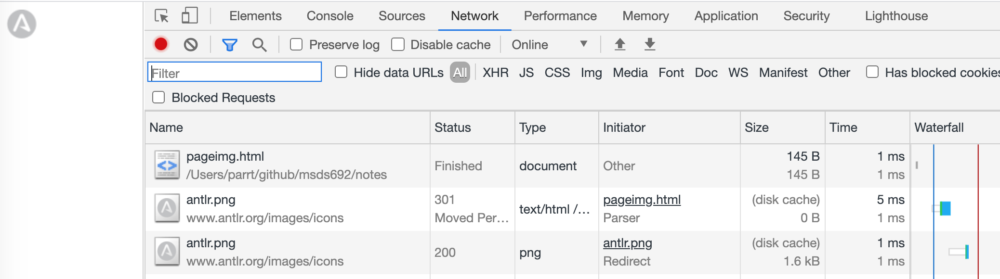

# Web site analytics

Over the last 15 years, tools that track activity on your website have become very common and very sophisticated. For example, here is a country of origin report from [Woopra](https://www.woopra.com/) concerning my research website (parrt: walk through woopra live app):


These tools can tell you way more than just which pages were accessed most frequently. They can tell you about search terms, browsers, languages, and so on.

**Q**. How the heck does this work? How does Woopra know about my little research website?

## Background

When a browser visits a particular web page, we know that it opens a socket to the server associated with that URL and fetches the HTML (or other data). From there, it renders the HTML visually. It turns out there are a number of HTML tags that actually require the browser to "secretly" fetch data from the same or other servers. Image tags are the most obvious example. In order to display an image, the browser has to fetch that file.

### Which servers does CNN contact?

Using a channel snooper (a proxy), I captured the following histogram of hosts contacted by a **single** visit to the cnn.com home page.

```
  25 	www.cnn.com
   6 	i.cdn.turner.com
   5 	download.cdn.mozilla.net
   4 	z.cdn.turner.com
   2 	widgets.outbrain.com
   2 	hpr.outbrain.com
   2 	131788053.log.optimizely.com
   1 	www.googletagservices.com
   1 	vrt.outbrain.com
   1 	secure-us.imrworldwide.com
   1 	metrics.cnn.com
   1 	log.outbrain.com
   1 	i2.cdn.turner.com
   1 	fast.fonts.net
   1 	facebook.com
   1 	data.cnn.com
   1 	consent.truste.com
   1 	connect.facebook.net
   1 	cdn.optimizely.com
   1 	cdn.livefyre.com
   1 	cdn.krxd.net
   1 	cdn.gigya.com
   1 	cdn.clicktale.net
   1 	b.scorecardresearch.com
   1 	a.visualrevenue.com
```

You can see a lot of weird stuff in there, much of it for ads. For example, Facebook and clicktale. Clicktale's website claims "*Clicktale reveals consumer behavior, needs and intent at every touchpoint of the digital conversation, delivering insights to delight customers and create more value.*"
 
### A toy example

In order to learn the mechanics, consider the following simple webpage with a reference to an image on another site. This HTML file would presumably be on some server xyz.com:


The HTML asks the browser to display a simple image:


Your browser makes **two** web requests, one to xyz.com to get the page itself and **another** to www.antlr.org for the image.

Using the inspector in Google Chrome on [pageimg.html](pageimg.html), we can see that this page fetches the icon:



Any page on the Internet that references this image would notify my antlr.org server every time a browser visited that page. Now imagine that the image is an invisible 1x1 image and you can see how it could be hidden in lots of websites. Antlr.org could then track references to pages all over the net.   The amount we can track from this image reference depends on how much information we add to the `img` tag URL. Here we are not adding anything but typically JavaScript is used to collect all sorts of information and pass it to the tracking server through URL parameters or cookies (more on this later).

### Exercise

Work with a partner on this. One person makes an html page called `t.html` that references a URL on your partner's computer via an `img` tag:

```html
<html>
<body>

</body>
</html>
```

You can view that file with `open t.html` from a mac command line. You are doing this from **your** laptop, not your partners.

The partner has to have a flask server running with URL `/track` available (in perhaps `server.py`):

```python
from flask import Flask
import netifaces as ni
ip = ni.ifaddresses('en0')[ni.AF_INET][0]['addr']

app = Flask(__name__)

@app.route("/track")
def trackme():
    return ""

app.run(host=ip)
```

When that server starts up you will see something like the following:

```bash
$ python server.py
 * Running on http://172.16.198.184:5000/ (Press CTRL+C to quit)
...
```

where `172.16.198.184` is the partner's computer's IP address.  Pay attention to this because that is the IP address that the HTML file's `img` tag should reference on your laptop. The HTML file is on another person's computer.

Every time you refresh the browser on your laptop, your partner should see a log entry such as the following appear on their screen:

```
172.16.198.180 - - [17/Sep/2017 12:42:05] "GET /track HTTP/1.1" 200 -
```

where perhaps the `172.16.198.180` is the IP address of your laptop (the one showing the `t.html` file), not the laptop running the server.

### What is JavaScript?

Modern tracking mechanisms use more than simple `img` tags--they use JavaScript code. JavaScript is an object-oriented programming language (that has similar syntax to Java but is oh so very different in semantics) that executes within your browser. Unlike Python, which we can run from the commandline or from within the development environment, JavaScript is typically stored as part of an HTML page and sent from a server back to a browser. The browser displays the HTML page and executes the JavaScript code.

**Exercise**. Try to get the following two simple JavaScript-based pages working in your browser. Play around with the JavaScript, such as changing the string in the `alert` function call.

Here's a simple [example](alertjs.html) that pops up a dialog box when you visit the page but doesn't show anything in the page itself.

```html
<html>
<body>
  <script>
    alert('Hello, World!')
  </script>
</body>
</html>
```

And here's a [web page](domjs.html) that contains no HTML as static data. Instead a JavaScript program creates the HTML on-the-fly in the browser. I.e., no HTML body tags (other than the JavaScript) is sent from the server.

```html
<html>
<body>
  <script>
  document.body.innerHTML = "<h1>Hi from "+location.pathname+"</h1>"
  </script>
</body>
</html>
```

If you do a "Save As...", you will get the page as you see here, not an actual HTML file with `h1` tags etc... The JavaScript is creating the HTML on the fly.  What that means is that doing a fetch with Python, such as `requests.get(...)`, will yield the JavaScript and not the page you see when you visit in the browser.

On the other hand, if you open the developer tools (in Chrome), you can view the HTML generated by the JavaScript and find out all sorts of things about the display page:


Of course, you can also see the source code by clicking on the `Sources` tab.


There is also an amazing JavaScript debugger.

## Tracking mechanism

Okay, let's look at web analytics tracking for real now using two commercial web analytics tools, Woopra and Google analytics.
 
Every page for which I want tracking, I include the following snippet, which you can see by asking for page source on any of my `antlr.org` pages:

```html
<!-- Start of Woopra Code -->
<script>
(function(){
    var t,i,e,n=window,o=document,a=arguments,s="script",
    r=["config","track","identify","visit","push","call","trackForm",
    "trackClick"],c=function(){
    ...
})("woopra");
woopra.config({
    domain: 'antlr.org'
});
woopra.track();
</script>
<!-- End of Woopra Code -->
```

This is JavaScript code that contacts Woopra every time this code executes, which is every time the browser loads this page.

I also use Google analytics, which has different looking code but same mechanism:

```html
<script>
  (function(i,s,o,g,r,a,m){i['GoogleAnalyticsObject']=r;i[r]=i[r]||function(){
  (i[r].q=i[r].q||[]).push(arguments)},i[r].l=1*new Date();a=s.createElement(o),
  m=s.getElementsByTagName(o)[0];a.async=1;a.src=g;m.parentNode.insertBefore(a,m)
  })(window,document,'script','//www.google-analytics.com/analytics.js','ga');
  ga('create', 'xxxxxxxxx', 'auto');
  ga('send', 'pageview');
</script>
```

The URL buried in there is the contact address: `www.google-analytics.com/analytics.js`. The JavaScript adds lots of parameters that get sent to the target URL. These identify the page name and lots of information about the browser, operating system, etc. of the user.

Ok, in a nutshell, web tracking works when a website developer includes a bit of JavaScript code from a tracking company, such as Woopra. The snippet of code contacts the tracking company upon each page view in a browser. Website owners can then go to the dashboard at the tracking company and look at a summary.

## Homebrew web analytics

**Exercise**. Let's build our own web analytics server, a more sophisticated version of the exercise we did above.  To make it respond to requests for `localhost` and your laptops actual IP address, change the `run()` command to be:

```python
app.run(host='0.0.0.0')
```

Ok, so we need a server that answers:

* `http://127.0.0.1:5000/track.gif?page=...` Any page with an image reference to this URL will notify our server.
* `http://127.0.0.1:5000/dashboard` If we go to this URL in a browser, we should see a histogram of the page views.

(Our flask servers by default pop up at URL `http://127.0.0.1:5000`.)

For the purposes of this exercise, you can use this [directory of files](https://github.com/parrt/msds692/tree/master/notes/code/webanalytics/static). Put that `static` directory in the same directory as your Python code.  For example, the `static/index.html` file looks like:

```html
<html>
<body>
A fake home page with <a href="anotherpage.html">link to some other page</a>.


</body>
</html>
```

If you open that file in a browser, the `img` tag will contact our server, indicating that somebody has accessed page `index.html`.  Recall that the browser makes another socket connection to some remote server for each image tag.

Here is a starter kit for your `server.py` file:

```python
from flask import Flask
from flask import request
import netifaces as ni
ip = ni.ifaddresses('en0')[ni.AF_INET][0]['addr']
print("This machines IP address is "+ip)

app = Flask(__name__)

@app.route("/track.gif")
def track():
    # get the 'page' request argument (google it)
    page = ...
    if len(page)>0:
        print("Visit to page "+page)
    # return the result of calling app.send_static_file on 'images/shim.gif'

app.run(host='0.0.0.0')
```

Once you think you have your server going, open your browser on the local file `static/index.html`. You should see `Visit to page index.html` as output from the running server. Try it a few times and click on the link to `anotherpage.html`. You should see different output in the server console.

Now, add a `dashboard` function to your server that is triggered when someone visits URL `http://127.0.0.1:5000/dashboard`.

```
@app.route("/dashboard")
def dashboard():
    ...
```

To keep track of the page views, use a `Counter` object initialized as a global variable:

```python
pageviews = Counter()
```

You will have to modify `track()` so that it updates `pageviews`. The `dashboard()` function can then create and return an HTML table string that shows the histogram such as:


The HTML looks like:

```html
<table>
<tr><th>Count</th><th>Page name</th></tr>
<tr><td>3</td><td>index.html</td></tr>
<tr><td>6</td><td>anotherpage.html</td></tr>
</table>
```

If you want, you can `pip install html` and then use the `HTML` object to create the HTML table. For example, here is how I started creating my HTML page using the package:

```python
page = HTML()
t = page.table()
r = t.tr
r.th("Count")
r.th("Page name")
...
```

The [solution](https://github.com/parrt/msds692/blob/master/notes/code/webanalytics/server.py) is available.

### Going further

If you are a more advanced programmer, you can improve the functionality of the server by adding parameters to the tracking `img` tag that include the referring page automatically, instead of manually as it's done now (using JavaScript). You can look up on the web how to get access to the page, the browser, the language, even the size of the user screen. All of this can be passed as arguments to the image reference. Your tracking function must then record this in addition to the page name. Your `Counter` object used previously, that tracked page name to count, is still useful but you should add another `Counter` for each parameter you pass, such as user agent (browser). Then you should modify your dashboard to include that information as well.

Next, you can modify the HTML files so they reference your actual IP address instead of 127.0.0.1. Give those files to another person and have them load the files in their browser. You should see their requests as output from your server and your dashboard should reflect that when you refresh.